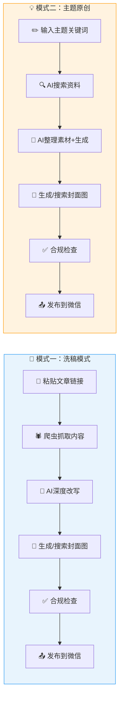
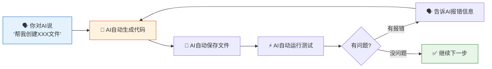
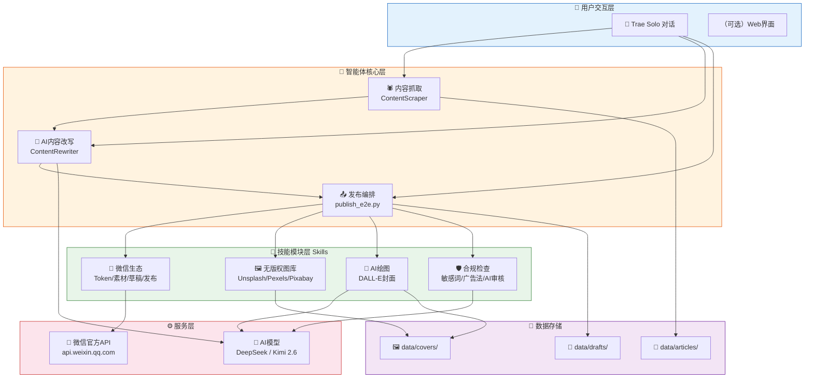

# 从零搭建微信公众号自动发文智能体 - 小白完整教程

> **适用人群**：零基础新手，你不需要会写代码——只需要会用鼠标和键盘，能对 AI 说话。
> **开发方式**：全程在 **Trae IDE 的 Solo 模式**下，你对 AI 说需求，AI 帮你写代码、创建文件、运行命令。
> **AI 模型**：本教程使用 **DeepSeek + Kimi 2.6** 驱动文章改写（你也可以换成其他兼容 OpenAI 接口的模型）。
> **最终成果**：一个能自动抓取文章、AI改写去AI味、自动排版、自动发布到微信公众号的全流程智能体。
> **预计总耗时**：新手约 1-2 天（每天 3-4 小时，大部分时间是在等 AI 干活）。

---

## 目录

1. [前言：这个智能体能做什么？](#前言这个智能体能做什么)
2. [准备工作：你需要申请哪些东西](#准备工作你需要申请哪些东西)
3. [环境搭建：安装必要的软件](#环境搭建安装必要的软件)
4. [项目骨架搭建](#项目骨架搭建)
5. [配置文件管理](#配置文件管理)
6. [核心模块开发：文章抓取](#核心模块开发文章抓取)
7. [核心模块开发：AI内容改写](#核心模块开发ai内容改写)
8. [技能模块：图片素材](#技能模块图片素材)
9. [技能模块：AI绘图](#技能模块ai绘图)
10. [技能模块：内容合规检查](#技能模块内容合规检查)
11. [技能模块：微信生态](#技能模块微信生态)
12. [MCP服务：把所有能力串起来](#mcp服务把所有能力串起来)
13. [端到端发布流程（模式一：洗稿发布）](#端到端发布流程)
14. [模式二：根据主题自动原创生成](#模式二补充根据主题自动原创生成)
15. [常见坑与解决方案](#常见坑与解决方案)
16. [进阶优化方向](#进阶优化方向)

---

## 前言：这个智能体能做什么？

这个智能体支持**两种创作模式**，覆盖你日常写公众号文章的所有场景：

### 模式一：根据已有文章改写（洗稿模式）

你看到一篇写得不错的文章，想参考它的内容但要有自己的原创表达。

```
① 给智能体一个微信公众号文章链接
        ↓
② 用爬虫把文章内容抓取下来（标题、正文、图片）
        ↓
③ 用AI对文章进行深度改写（去AI味、提高原创度、调整风格）
        ↓
④ 用AI生成封面图（或从无版权图库搜索配图）
        ↓
⑤ 对改写后的内容进行合规检查（敏感词、广告法）
        ↓
⑥ 上传图片到微信公众号素材库
        ↓
⑦ 创建文章草稿
        ↓
⑧ 发布（或提交人工审核）
```

### 模式二：根据主题自动生成（纯原创模式）

你脑子里有一个话题/关键词，但还没有具体素材——让AI帮你从零到一写出一篇完整的原创文章。

```
① 你告诉智能体一个主题（比如"AI中转站商业模式分析"）
        ↓
② AI 自动联网搜索相关资料（新闻、数据、观点）
        ↓
③ AI 整理素材，提取核心观点和关键数据
        ↓
④ AI 按照你指定的风格生成一篇完整的原创文章
        ↓
⑤ AI 自动生成封面图（或从无版权图库搜索配图）
        ↓
⑥ 合规检查 → 上传素材 → 发布
```

> 💡 比如你对 Trae 的 AI 说：**"帮我写一篇关于'AI中转站商业模式'的公众号深度分析文章，风格偏商业分析，3000字左右"**，它就会自动搜索资料、整理素材、生成文章、配图、发布，你只需要确认一下就行。

**核心价值**：不管是洗稿别人的好文章，还是从零原创一个话题，这个智能体都能帮你把每天 2-3 小时的内容创作压缩到 5 分钟。

📊 **两种模式链路对比图**（一眼看懂系统工作原理）：



---

## 准备工作：你需要申请哪些东西

在写一行代码之前，先把下面这些"账号和密钥"搞定。**这是最容易踩坑的环节，请耐心完成**。

### 1. 一个微信公众号（必须）

- **类型**：订阅号或服务号都可以
- **注册地址**：https://mp.weixin.qq.com
- **准备材料**：身份证、一个未被微信公众平台绑定的邮箱
- **注意**：个人只能注册订阅号，每天可以群发 1 条消息。企业可以注册服务号。

> ⚠️ **关键信息**：注册成功后，你需要获取两个核心参数：
> - **AppID**：在「设置与开发 → 基本配置」中查看
> - **AppSecret**：点击「生成」按钮，用管理员微信扫码后获取。**这个密钥只显示一次，务必保存好！**

### 2. AI 大模型 API Key（必须）

- **作用**：驱动AI改写文章、生成封面图、内容合规审核
- **本教程使用的模型**：
  - **DeepSeek**：https://platform.deepseek.com —— 便宜大碗，中文改写效果极佳，支持 OpenAI 兼容接口。新用户送免费额度。
  - **Kimi（月之暗面）**：https://platform.moonshot.cn —— 长文本处理能力强，适合长文章改写。

> 💡 如果你有其他模型方案，可以直接替换，只要模型支持 OpenAI 兼容的 Chat Completions 接口即可。在 `.env` 文件中改一下 `AI_API_BASE` 和 `AI_MODEL` 就行。

> ⚠️ **省钱提示**：文章改写用 DeepSeek 级别模型完全够用，单篇文章改写成本约 1-2 分钱人民币。先用便宜模型跑通流程，效果不满意再换贵的。

### 3. 无版权图片库 API（可选但强烈建议）

如果你的文章需要配图（绝大多数文章都需要），注册以下**至少一个**图片库的 API。前两个免费额度很充裕：

| 平台 | 注册地址 | 免费额度 |
|------|---------|---------|
| **Unsplash** | https://unsplash.com/developers | 每小时 50 次请求 |
| **Pexels** | https://www.pexels.com/api | 每月 200 次请求 |
| **Pixabay** | https://pixabay.com/api/docs | 免费，无需注册 |

> 注册后获取的密钥在对应平台分别叫做：
> - Unsplash：Access Key
> - Pexels：API Key
> - Pixabay：API Key

### 4. Trae IDE（零代码基础也能用的 AI 编程工具）

- **Trae IDE**（字节跳动出品）：https://www.trae.ai
  - 完全免费，内置 AI 编程助手
  - **Solo 模式**：你只需要用自然语言对 AI 说话，AI 会自动帮你创建文件、写代码、运行命令，你基本不需要自己动手敲命令
  - 本教程的核心开发方式就是 **"你说话，AI 干活"**——你只需告诉 Trae 的 AI "帮我创建一个 Python 项目""帮我安装依赖""帮我写一个文章抓取模块"，它就帮你全部搞定
  - 本教程中使用的 MCP（Model Context Protocol）功能也需要 Trae IDE 的支持

> 💡 **本教程的开发理念**：你不需要懂太多代码。你只要知道你要做什么，然后把需求用**普通话**告诉 Trae 的 AI，它就会自动帮你创建文件、写代码、安装依赖。教程中展示的所有代码，你都可以通过跟 AI 对话来生成，不用自己一行行敲。

---

## 环境搭建：安装必要的软件

> 💡 **重要提示**：下面这两步（Python 和 Node.js 安装）需要你自己在电脑上安装好，因为这是系统级的软件。后面的所有操作，你都可以在 Trae IDE 里对 AI 说一句话就搞定，不需要自己敲命令。

### 第一步：安装 Python

1. 打开浏览器，访问：https://www.python.org/downloads/
2. 下载 **Python 3.10 或更高版本**（建议 3.11 或 3.12）
3. **安装时务必勾选"Add Python to PATH"**（这一步非常重要，否则后面命令行无法识别 `python` 命令）

安装完后，打开 PowerShell，输入 `python --version` 验证，应该输出类似 `Python 3.12.0`。

### 第二步：安装 Node.js（用于爬虫）

智能体使用 Playwright 进行浏览器级别的文章抓取，这需要 Node.js。

1. 访问：https://nodejs.org
2. 下载 **LTS 版本**（长期支持版，当前推荐 20.x 或 22.x）
3. 一路默认安装即可

安装完后，输入 `node --version` 和 `npm --version` 验证。

### 第三步：打开 Trae IDE，用 Solo 模式开始开发

1. 打开 Trae IDE，点击 **Solo 模式**
2. 在对话框里告诉 AI：

> "帮我在桌面上创建一个叫'微信公众号自动发文'的文件夹，在里面初始化一个 Python 项目，创建虚拟环境 venv，然后创建 requirements.txt 并安装这些依赖：wechatpy、openai、requests、beautifulsoup4、lxml、python-dotenv、pillow、markdown、pyyaml、cachetools、playwright、scrapling。"

AI 会自动帮你完成：

- 创建项目文件夹和 Python 虚拟环境
- 生成 `requirements.txt` 并安装所有依赖
- 执行 `playwright install chromium` 安装浏览器

### 第四步：初始化 Git（可选）

同样，在 Trae 对话框里说：

> "帮我初始化 git 仓库，创建 .gitignore 文件，忽略 venv/、__pycache__/、.env 等文件。"

到这一步，电脑环境就准备好了。**你从头到尾只在初期安装了两个软件，剩下的全是跟 AI 说话搞定的。** 接下来继续用这种方式写代码。

---

📊 **你的开发方式**（不用写代码，只动嘴）：



> 💡 看到没？就是一个循环：**你说需求 → AI写代码 → 跑一跑 → 有问题告诉AI → AI修 → 继续下一个模块**。教程后面每个章节的代码你不需要自己写，把代码块内容丢给AI就行。

## 项目骨架搭建

在 Trae 的 Solo 模式对话框里说：

> "帮我按照以下结构创建项目目录，并且在每个 Python 包文件夹里放入空的 __init__.py 文件："

然后把下面的目录结构贴给 AI，它会自动帮你全部创建好：

```
微信公众号自动发文/
├── config/           # 配置文件
├── data/
│   ├── articles/     # 抓取和改写后的文章
│   ├── covers/       # 封面图
│   ├── drafts/       # 草稿
│   └── published/    # 已发布记录
├── docs/             # 文档
├── scripts/          # 运行脚本
├── skills/           # 技能模块
│   ├── wechat_ecosystem/
│   ├── copyright_free_images/
│   ├── ai_drawing/
│   └── content_compliance/
├── src/
│   ├── core/         # 核心模块
│   ├── models/       # 数据模型
│   ├── services/     # 服务层
│   └── utils/        # 工具函数
├── tests/            # 测试
├── .env              # 环境变量（敏感信息）
├── .gitignore
├── requirements.txt
└── README.md
```

> 💡 一句话总结本教程的操作方式：**以后每个步骤，你只需要把教程里"创建 XXX 文件，写入以下内容"后面的代码，复制粘贴给 Trae 的 AI，对它说"帮我创建这个文件"，它就会自动帮你生成。** 教程里展示的所有代码，你不需要手打，甚至不需要完全理解——AI 会帮你搞定。

---

📊 **系统架构全景图**（先看看整个系统长什么样，心里有数）：



---

