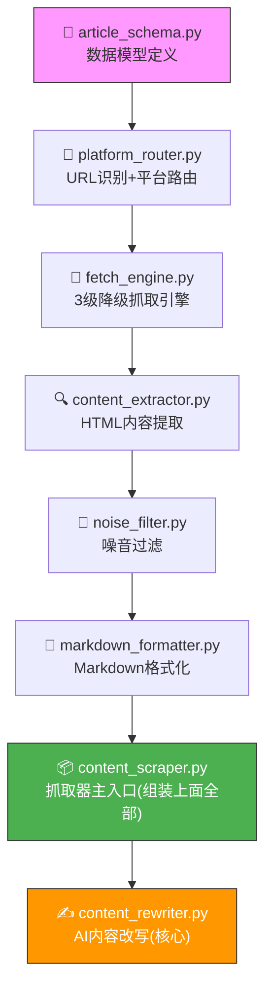

## 配置文件管理

配置文件是整个项目的"控制面板"，所有密钥和参数都在这里集中管理。

### 1. 创建环境变量模板

创建 `config\.env.example` 文件（对 Trae AI 说"帮我创建配置文件模板"）：

```
# ============================================
# 微信公众号全自动发布智能体 - 环境变量配置模板
# 复制此文件为 .env 并填入真实值
# ============================================

# 微信公众号配置
WECHAT_APP_ID=your_app_id_here
WECHAT_APP_SECRET=your_app_secret_here

# AI模型API配置（本教程使用 DeepSeek 和 Kimi）
AI_API_KEY=your_api_key_here
AI_API_BASE=https://api.deepseek.com/v1
AI_MODEL=deepseek-chat

# 日志级别
LOG_LEVEL=INFO

# 运行环境
ENVIRONMENT=development
```

### 2. 创建真实配置文件

对 Trae AI 说"帮我复制 config/.env.example 为项目根目录的 .env"，然后用文本编辑器打开 `.env` 文件，把占位符替换成你申请到的真实密钥：

```
WECHAT_APP_ID=wx1234567890abcdef
WECHAT_APP_SECRET=abc123def456ghi789
AI_API_KEY=sk-your-deepseek-api-key
AI_API_BASE=https://api.deepseek.com/v1
AI_MODEL=deepseek-chat
```

> ⚠️ **极其重要的安全提醒**：
> 1. `.env` 文件包含你的所有密钥，**绝对不要上传到 GitHub 或分享给别人**！
> 2. `.gitignore` 文件里已经写了 `.env`，确保它不会被 Git 追踪。
> 3. 如果你用其他模型，修改 `AI_API_BASE` 和 `AI_MODEL` 即可：
>    - DeepSeek: `https://api.deepseek.com/v1`，模型 `deepseek-chat`
>    - Kimi: `https://api.moonshot.cn/v1`，模型 `moonshot-v1-8k`

### 3. 创建 YAML 应用配置

创建 `config\config.yaml` 文件，这是应用的全局配置：

```yaml
# ============================================
# 微信公众号全自动发布智能体 - 应用配置
# ============================================

app:
  name: "WeChat Auto Publisher"
  version: "0.1.0"
  debug: true

# 微信公众号配置
wechat:
  app_id: ""          # 从环境变量 WECHAT_APP_ID 读取
  app_secret: ""      # 从环境变量 WECHAT_APP_SECRET 读取
  token_cache_seconds: 7200   # Access Token 缓存时间

# AI模型配置
ai:
  provider: "deepseek"
  model: "deepseek-chat"
  temperature: 0.7
  max_tokens: 4000
  timeout: 60
  max_retries: 3

# 发布配置
publish:
  default_style: "professional"
  max_article_length: 5000
  require_review: true
  auto_publish: false

# 日志配置
logging:
  level: "INFO"
  rotation: "00:00"
  retention: "30 days"

# 数据存储
storage:
  drafts_dir: "data/drafts"
  published_dir: "data/published"
  templates_dir: "data/templates"
```

### 4. 创建技能注册配置

创建 `skills\skills.json`，这个文件声明了所有技能模块的信息：

```json
{
  "skills": {
    "wechat-ecosystem": {
      "name": "微信生态全量技能",
      "version": "1.0.0",
      "description": "微信公众号全生命周期管理：素材管理、草稿创建/编辑/发布、Token管理",
      "capabilities": ["素材管理", "草稿管理", "文章发布", "二维码生成", "菜单管理"],
      "config_required": ["WECHAT_APP_ID", "WECHAT_APP_SECRET"]
    },
    "copyright-free-images": {
      "name": "无版权商用图片素材技能",
      "version": "1.0.0",
      "description": "多渠道无版权图片搜索与下载",
      "capabilities": ["跨平台图片搜索", "批量下载", "尺寸筛选"],
      "config_required": ["UNSPLASH_ACCESS_KEY|PEXELS_API_KEY|PIXABAY_API_KEY"]
    },
    "ai-drawing": {
      "name": "AI绘图技能",
      "version": "1.0.0",
      "description": "AI文生图：DALL-E API、封面图自动生成",
      "capabilities": ["文生图", "封面图生成", "多风格支持"],
      "config_required": ["AI_API_KEY"]
    },
    "content-compliance": {
      "name": "内容合规校验技能",
      "version": "1.0.0",
      "description": "中文内容合规审查：敏感词检测、广告法检查、AI内容安全审核",
      "capabilities": ["敏感词检测", "广告法合规检查", "AI深度审核"],
      "config_required": ["AI_API_KEY"]
    }
  }
}
```

---

📊 **核心模块依赖关系图**（接下来的章节按这个顺序开发，每个模块做什么一目了然）：



## 核心模块开发：文章抓取

这是我们写的第一个真正干活的模块。它的作用是把微信公众号文章的内容（标题、正文、图片）完整抓取下来。

### 为什么需要这个模块？

微信公众号文章不能直接通过 `requests.get()` 获取到完整内容，因为微信的文章内容是通过 JavaScript 动态渲染的。所以我们需要用 **Playwright**（一个自动化浏览器工具）来模拟真实浏览器访问。

### 1. 创建文章数据模型

先用数据模型定义好"一篇文章长什么样"。

创建 `src\core\article_schema.py`：

```python
"""
文章数据模型 - 定义文章抓取全链路的结构化数据类型
"""

from enum import Enum
from typing import Optional
from dataclasses import dataclass, field


class PlatformType(str, Enum):
    """支持的平台类型"""
    WECHAT = "wechat"
    ZHIHU_ARTICLE = "zhihu_article"
    TOUTIAO = "toutiao"
    UNKNOWN = "unknown"


class FetcherType(str, Enum):
    """抓取器类型 - 3级降级策略"""
    FETCHER = "Fetcher"           # 普通HTTP请求
    STEALTHY = "StealthyFetcher"  # 隐身模式（绕过基础反爬）
    DYNAMIC = "DynamicFetcher"    # 完整浏览器渲染


class ScrapeStatus(str, Enum):
    """抓取状态"""
    SUCCESS = "success"
    PARTIAL = "partial"
    FAILED = "failed"
    LOGIN_REQUIRED = "login_required"
    PAYWALL = "paywall"
    TIMEOUT = "timeout"
    BLOCKED = "blocked"


@dataclass
class ImageItem:
    """图片数据"""
    url: str
    alt: str = ""
    width: int = 0
    height: int = 0
    local_path: str = ""


@dataclass
class ArticleData:
    """文章完整数据"""
    url: str
    platform: PlatformType = PlatformType.UNKNOWN
    title: str = ""
    author: str = ""
    publish_time: str = ""
    content: str = ""              # 纯文本正文
    content_html: str = ""         # HTML格式正文
    summary: str = ""              # 摘要
    images: list[ImageItem] = field(default_factory=list)
    status: ScrapeStatus = ScrapeStatus.SUCCESS
    fetcher_used: FetcherType = FetcherType.FETCHER
    confidence: float = 0.0
    fetch_time_ms: int = 0
    retries: int = 0
    warnings: list[str] = field(default_factory=list)
    error_message: str = ""
    cached: bool = False


@dataclass
class FetchResult:
    """抓取结果"""
    url: str
    platform: PlatformType
    fetcher_type: FetcherType
    page_html: str
    http_status: int
    retries: int
    fetch_time_ms: int
    error: str = ""


@dataclass
class ScrapeConfig:
    """抓取配置"""
    timeout_default: int = 15
    timeout_dynamic: int = 30
    timeout_stealthy: int = 25
    max_retries_per_level: int = 2
    max_image_count: int = 20
    min_image_size: int = 100
    cache_enabled: bool = True
    user_agent: str = "Mozilla/5.0 (Windows NT 10.0; Win64; x64) AppleWebKit/537.36"
    headless: bool = True
    impersonate: str = "chrome120"
    backoff_base: int = 2
```

### 2. 创建平台路由

这个模块负责"识别用户给的 URL 是哪个平台的"，然后选择对应的抓取策略。

创建 `src\core\platform_router.py`：

```python
"""
平台路由器 - 识别URL来源并路由到对应抓取策略
"""

import re
from urllib.parse import urlparse

from src.core.article_schema import (
    PlatformType, PlatformRule, ScrapeConfig
)


# ============================================================
# 各平台的CSS选择器规则
# ============================================================

PLATFORM_RULES = {
    PlatformType.WECHAT: PlatformRule(
        platform=PlatformType.WECHAT,
        title_selectors=["#activity-name", ".rich_media_title", "h1"],
        content_selectors=["#js_content", ".rich_media_content"],
        author_selectors=["#js_name", ".rich_media_meta_text", ".profile_nickname"],
        time_selectors=["#publish_time", ".rich_media_meta_text"],
        needs_dynamic=True,   # 微信文章需要JS渲染
        needs_stealth=True,   # 需要反反爬
        noise_selectors=[".rich_media_area_extra", ".reward_area", ".like_comment_wrp"],
    ),
    PlatformType.ZHIHU_ARTICLE: PlatformRule(
        platform=PlatformType.ZHIHU_ARTICLE,
        title_selectors=[".Post-Title", ".QuestionHeader-title", "h1.Post-Title"],
        content_selectors=[".RichContent-inner", ".Post-RichText"],
        author_selectors=[".AuthorInfo-name", ".Post-Author"],
        time_selectors=[".ContentItem-time", ".Post-Header time"],
        needs_dynamic=True,
        noise_selectors=[".ContentItem-actions", ".Post-AuthorFollowButton"],
    ),
    PlatformType.UNKNOWN: PlatformRule(
        platform=PlatformType.UNKNOWN,
        title_selectors=["h1", "title", '[itemprop="headline"]', ".article-title"],
        content_selectors=["article", ".article-content", '[itemprop="articleBody"]', ".post-content", "main"],
        author_selectors=['[rel="author"]', ".author", '[itemprop="author"]'],
        time_selectors=["time", '[itemprop="datePublished"]', ".publish-time"],
    ),
}


class PlatformRouter:
    """根据URL识别平台"""

    # URL识别规则
    URL_PATTERNS = [
        (r"mp\.weixin\.qq\.com", PlatformType.WECHAT),
        (r"zhihu\.com/question/\d+/answer/\d+", PlatformType.ZHIHU_ANSWER),
        (r"zhihu\.com", PlatformType.ZHIHU_ARTICLE),
        (r"toutiao\.com", PlatformType.TOUTIAO),
    ]

    def identify(self, url: str) -> PlatformType:
        """根据URL自动识别平台"""
        for pattern, platform in self.URL_PATTERNS:
            if re.search(pattern, url, re.IGNORECASE):
                return platform
        return PlatformType.UNKNOWN

    def validate_url(self, url: str) -> tuple[bool, str]:
        """验证URL是否合法"""
        if not url:
            return False, "URL不能为空"
        try:
            parsed = urlparse(url)
            if not parsed.scheme or not parsed.netloc:
                return False, f"无效URL: {url}"
        except Exception as e:
            return False, f"URL解析失败: {e}"
        return True, ""

    def get_rule(self, platform: PlatformType) -> PlatformRule:
        """获取平台抓取规则"""
        return PLATFORM_RULES.get(platform, PLATFORM_RULES[PlatformType.UNKNOWN])
```

### 3. 创建抓取引擎

这是真正执行"去网页上拿内容"的模块。它采用了**3级降级抓取策略**：
- Level 1：普通 HTTP 请求（最快，但容易被拦截）
- Level 2：隐身模式（绕过基础反爬虫）
- Level 3：完整浏览器渲染（最强，能处理微信这种 JS 渲染的页面）

创建 `src\core\fetch_engine.py`：

```python
"""
抓取引擎 - 3级降级Fetcher + 重试 + 超时
"""

import time
import logging
from typing import Optional

from src.core.article_schema import (
    FetcherType, FetchResult, PlatformType, ScrapeConfig
)
from src.core.platform_router import PLATFORM_RULES

logger = logging.getLogger(__name__)


class FetchEngine:
    """3级降级抓取引擎"""

    def __init__(self, config: ScrapeConfig = None):
        self.config = config or ScrapeConfig()

    def fetch(self, url: str, platform: PlatformType = PlatformType.UNKNOWN) -> FetchResult:
        """主要抓取方法"""
        rule = PLATFORM_RULES.get(platform, PLATFORM_RULES[PlatformType.UNKNOWN])
        strategies = self._build_strategies(url, rule)
        last_error = ""

        for fetcher_type, method in strategies:
            t_start = time.time()
            retries = 0
            for attempt in range(self.config.max_retries_per_level + 1):
                try:
                    logger.info(f"[FetchEngine] {fetcher_type.value} 第{attempt+1}次尝试 {url}")
                    html, status = method(url)
                    elapsed_ms = int((time.time() - t_start) * 1000)
                    return FetchResult(
                        url=url, platform=platform, fetcher_type=fetcher_type,
                        page_html=html, http_status=status, retries=retries,
                        fetch_time_ms=elapsed_ms,
                    )
                except Exception as e:
                    retries = attempt
                    last_error = str(e)
                    logger.warning(f"[FetchEngine] {fetcher_type.value} 失败: {last_error}")
                    time.sleep(self.config.backoff_base ** attempt)

        return FetchResult(
            url=url, platform=platform, fetcher_type=FetcherType.DYNAMIC,
            page_html="", http_status=0, retries=0, fetch_time_ms=0,
            error=f"3级抓取全部失败: {last_error}",
        )

    def _build_strategies(self, url: str, rule):
        """按需构建抓取策略链"""
        strategies = []
        # Level 1: 普通HTTP
        strategies.append((FetcherType.FETCHER, lambda u: self._fetch_simple(u)))
        # Level 2: 隐身模式（如果需要）
        if rule.needs_stealth:
            strategies.append((FetcherType.STEALTHY, lambda u: self._fetch_stealthy(u)))
        # Level 3: 浏览器渲染（如果需要）
        if rule.needs_dynamic:
            strategies.append((FetcherType.DYNAMIC, lambda u: self._fetch_dynamic(u)))
        return strategies

    def _fetch_simple(self, url: str) -> tuple[str, int]:
        """普通HTTP请求"""
        import requests
        headers = {"User-Agent": self.config.user_agent}
        resp = requests.get(url, headers=headers, timeout=self.config.timeout_default)
        resp.raise_for_status()
        return resp.text, resp.status_code

    def _fetch_stealthy(self, url: str) -> tuple[str, int]:
        """隐身模式抓取"""
        import requests
        headers = {
            "User-Agent": self.config.user_agent,
            "Accept": "text/html,application/xhtml+xml",
            "Accept-Language": "zh-CN,zh;q=0.9",
            "Cache-Control": "no-cache",
        }
        resp = requests.get(url, headers=headers, timeout=self.config.timeout_stealthy)
        resp.raise_for_status()
        return resp.text, resp.status_code

    def _fetch_dynamic(self, url: str) -> tuple[str, int]:
        """浏览器级动态渲染（使用Playwright）"""
        try:
            from playwright.sync_api import sync_playwright
            with sync_playwright() as p:
                browser = p.chromium.launch(headless=self.config.headless)
                context = browser.new_context(
                    user_agent=self.config.user_agent,
                    viewport={"width": 1280, "height": 800},
                )
                page = context.new_page()
                page.goto(url, wait_until="networkidle", timeout=self.config.timeout_dynamic * 1000)
                page.wait_for_timeout(2000)
                html = page.content()
                browser.close()
                return html, 200
        except ImportError:
            raise ImportError("需要安装 playwright: pip install playwright && playwright install chromium")
```

### 4. 创建内容提取器

拿到 HTML 页面后，需要从中提取标题、正文、作者、时间、图片。

创建 `src\core\content_extractor.py`：

```python
"""
内容提取器 - 从HTML中提取结构化文章内容
"""

from bs4 import BeautifulSoup
from typing import Optional

from src.core.article_schema import (
    ArticleData, ImageItem, PlatformType, ScrapeStatus
)
from src.core.platform_router import PLATFORM_RULES


class ContentExtractor:
    """从HTML中提取文章结构化数据"""

    def extract(self, html: str, url: str, platform: PlatformType = PlatformType.UNKNOWN) -> ArticleData:
        """主提取方法"""
        soup = BeautifulSoup(html, "lxml")
        rule = PLATFORM_RULES.get(platform, PLATFORM_RULES[PlatformType.UNKNOWN])

        title = self._extract_text(soup, rule.title_selectors)
        author = self._extract_text(soup, rule.author_selectors)
        publish_time = self._extract_text(soup, rule.time_selectors)

        content_html = self._extract_content_html(soup, rule.content_selectors)
        content_text = BeautifulSoup(content_html, "lxml").get_text("\n", strip=True) if content_html else ""

        images = self._extract_images(content_html)

        return ArticleData(
            url=url,
            platform=platform,
            title=title,
            author=author,
            publish_time=publish_time,
            content=content_text,
            content_html=content_html,
            images=images,
            status=ScrapeStatus.SUCCESS if title and content_text else ScrapeStatus.PARTIAL,
            warnings=[] if title else ["未能提取到标题"],
        )

    def _extract_text(self, soup: BeautifulSoup, selectors: list[str]) -> str:
        """按优先级尝试多个选择器提取文本"""
        for selector in selectors:
            el = soup.select_one(selector)
            if el:
                return el.get_text().strip()
        return ""

    def _extract_content_html(self, soup: BeautifulSoup, selectors: list[str]) -> str:
        """提取正文HTML"""
        for selector in selectors:
            el = soup.select_one(selector)
            if el:
                return str(el)
        return ""

    def _extract_images(self, content_html: str) -> list[ImageItem]:
        """从正文中提取图片列表"""
        if not content_html:
            return []
        soup = BeautifulSoup(content_html, "lxml")
        images = []
        for img in soup.find_all("img"):
            src = img.get("src") or img.get("data-src") or img.get("data-original", "")
            if src and not src.startswith("data:image/svg"):
                images.append(ImageItem(
                    url=src,
                    alt=img.get("alt", ""),
                ))
        return images
```

### 5. 创建噪音过滤器

创建 `src\core\noise_filter.py`：

```python
"""
噪音过滤器 - 去除文章中的广告、推荐阅读等无关内容
"""

from bs4 import BeautifulSoup


class NoiseFilter:
    """基于CSS选择器和规则去除页面噪音"""

    # 通用噪音选择器
    COMMON_NOISE_SELECTORS = [
        ".advertisement", ".ads", ".banner",
        ".share-buttons", ".social-share",
        ".comment-area", ".comments",
        ".related-posts", ".recommend",
        ".footer", "footer",
    ]

    def filter(self, content_html: str, platform: str = "") -> str:
        """过滤噪音内容"""
        soup = BeautifulSoup(content_html, "lxml")

        # 去除通用噪音
        for selector in self.COMMON_NOISE_SELECTORS:
            for el in soup.select(selector):
                el.decompose()

        # 去除空标签
        for el in soup.find_all():
            if not el.get_text(strip=True) and el.name not in ["br", "hr", "img"]:
                el.decompose()

        return str(soup.body) if soup.body else str(soup)
```

### 6. 创建 Markdown 格式化器

创建 `src\core\markdown_formatter.py`：

```python
"""
Markdown格式化器 - 将文章数据输出为结构化Markdown和JSON
"""

import json
import os
from datetime import datetime

from src.core.article_schema import ArticleData, ScrapeStatus


class MarkdownFormatter:

    def to_markdown(self, article: ArticleData, include_metadata: bool = True,
                    include_images: bool = True) -> str:
        """输出Markdown格式"""
        lines = []

        if article.status != ScrapeStatus.SUCCESS:
            lines.append(f"# 抓取失败\n\n> URL: {article.url}\n> 状态: {article.status.value}")
            if article.error_message:
                lines.append(f"\n**错误**: {article.error_message}")
            return "\n".join(lines)

        if include_metadata:
            lines.append(f"# {article.title}")
            lines.append("")
            lines.append(f"> **来源**: {article.platform.value} · [原文链接]({article.url})")
            if article.author:
                lines.append(f"> **作者**: {article.author} · **时间**: {article.publish_time}")
            if article.cached:
                lines.append("> ⚡ *来自缓存*")
            lines.append("")
            lines.append("---")
            lines.append("")

        lines.append(article.content)
        lines.append("")

        if include_images and article.images:
            lines.append("---")
            lines.append("")
            lines.append("## 图片列表")
            lines.append("")
            for i, img in enumerate(article.images):
                lines.append(f"{i+1}. ")

        return "\n".join(lines)

    def to_json(self, article: ArticleData) -> str:
        """输出JSON格式"""
        return json.dumps(self.to_dict(article), ensure_ascii=False, indent=2)

    def to_dict(self, article: ArticleData) -> dict:
        """转为字典"""
        return {
            "url": article.url,
            "platform": article.platform.value,
            "title": article.title,
            "author": article.author,
            "publish_time": article.publish_time,
            "content_length": len(article.content),
            "content_preview": article.content[:200],
            "images": [{"url": i.url, "alt": i.alt} for i in article.images],
            "image_count": len(article.images),
            "fetcher_used": article.fetcher_used.value,
            "fetch_time_ms": article.fetch_time_ms,
            "retries": article.retries,
            "status": article.status.value,
            "warnings": article.warnings,
        }

    def save(self, article: ArticleData, output_dir: str = "data/articles") -> dict:
        """保存为文件"""
        os.makedirs(output_dir, exist_ok=True)
        safe_title = "".join(c for c in article.title[:40] if c.isalnum() or c in " _-").strip() or "article"
        timestamp = datetime.now().strftime("%Y%m%d_%H%M%S")
        base = os.path.join(output_dir, f"{timestamp}_{safe_title}")

        md_path = base + ".md"
        with open(md_path, "w", encoding="utf-8") as f:
            f.write(self.to_markdown(article))

        json_path = base + ".json"
        with open(json_path, "w", encoding="utf-8") as f:
            f.write(self.to_json(article))

        return {"markdown": md_path, "json": json_path}
```

### 7. 创建内容抓取器主入口

这是前面几个模块的"组装入口"，把它们串成一个完整的抓取链路。

创建 `src\core\content_scraper.py`：

```python
"""
网页内容自动抓取解析模块 - 主入口
完整链路：URL路由 → 抓取 → 提取 → 过滤 → 格式化
"""

import hashlib
import logging
from collections import OrderedDict

from src.core.article_schema import ArticleData, ScrapeConfig, ScrapeStatus, PlatformType
from src.core.platform_router import PlatformRouter
from src.core.fetch_engine import FetchEngine
from src.core.content_extractor import ContentExtractor
from src.core.noise_filter import NoiseFilter
from src.core.markdown_formatter import MarkdownFormatter

logger = logging.getLogger(__name__)

# 简易缓存（避免重复抓取同一URL）
_cache_store: OrderedDict = OrderedDict()
CACHE_MAX_SIZE = 500


class ContentScraper:
    """内容抓取器 - 统一入口"""

    def __init__(self, config: ScrapeConfig = None):
        self.config = config or ScrapeConfig()
        self.router = PlatformRouter()
        self.fetcher = FetchEngine(self.config)
        self.extractor = ContentExtractor()
        self.noise_filter = NoiseFilter()
        self.formatter = MarkdownFormatter()

    def scrape(self, url: str, platform_hint: str = "") -> ArticleData:
        """抓取单篇文章"""
        # 1. 验证URL
        valid, err = self.router.validate_url(url)
        if not valid:
            return ArticleData(url=url, status=ScrapeStatus.FAILED, error_message=err)

        # 2. 检查缓存
        if self.config.cache_enabled:
            cached = self._get_cache(url)
            if cached:
                cached.cached = True
                return cached

        # 3. 识别平台
        platform = PlatformType(platform_hint) if platform_hint else self.router.identify(url)

        # 4. 抓取
        fetch_result = self.fetcher.fetch(url, platform)
        if fetch_result.error:
            return ArticleData(
                url=url, platform=platform,
                status=ScrapeStatus.FAILED,
                fetcher_used=fetch_result.fetcher_type,
                error_message=fetch_result.error,
            )

        # 5. 提取
        article = self.extractor.extract(fetch_result.page_html, url, platform)
        article.fetcher_used = fetch_result.fetcher_type

        # 6. 过滤噪音
        article.content_html = self.noise_filter.filter(article.content_html, platform.value)

        # 7. 存入缓存
        if self.config.cache_enabled:
            self._set_cache(url, article)

        return article

    def _get_cache(self, url: str) -> ArticleData:
        cache_key = hashlib.md5(url.encode()).hexdigest()
        return _cache_store.get(cache_key)

    def _set_cache(self, url: str, article: ArticleData) -> None:
        cache_key = hashlib.md5(url.encode()).hexdigest()
        _cache_store[cache_key] = article
        while len(_cache_store) > CACHE_MAX_SIZE:
            _cache_store.popitem(last=False)
```

---

