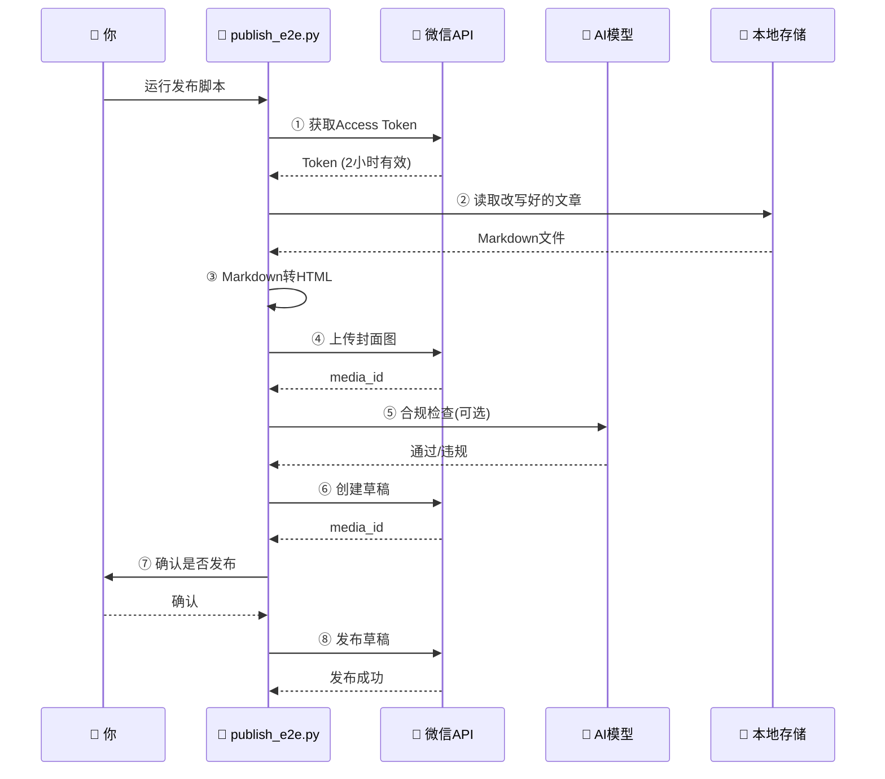

## MCP服务：把所有能力串起来

**MCP（Model Context Protocol）** 是 Anthropic 推出的一种标准协议，让 AI 助手（如 Claude、Trae IDE 的 AI）能够调用外部工具。

简单说：你注册了这个 MCP 服务后，就可以在 Trae IDE 里直接对 AI 说"帮我抓取这篇微信文章，改写后发布"，AI 就能自动调用你写的这些技能模块。

创建 `src\services\mcp\server.py`：

```python
"""
微信公众号MCP服务 - Model Context Protocol Server

使用 JSON-RPC 2.0 协议，提供以下工具：
- wechat_get_access_token     获取Token
- wechat_create_draft          创建草稿
- wechat_publish_draft         发布草稿
- wechat_upload_image          上传图片
- wechat_content_check         内容合规检查
- wechat_search_images         搜索无版权图片
- wechat_ai_draw               AI生成图片
- wechat_generate_cover        生成封面图
"""

import os
import sys
import json
import asyncio
from typing import Any
from pathlib import Path

# 确保能找到项目模块
PROJECT_ROOT = Path(__file__).resolve().parent.parent.parent.parent
if str(PROJECT_ROOT) not in sys.path:
    sys.path.insert(0, str(PROJECT_ROOT))


class WeChatMCPServer:
    """微信公众号 MCP Server"""

    def __init__(self):
        self._skills_loaded = False

    def _load_skills(self):
        """懒加载所有技能模块（第一次调用时才加载）"""
        if self._skills_loaded:
            return

        # 从环境变量读取密钥
        from dotenv import load_dotenv
        load_dotenv(PROJECT_ROOT / ".env")

        from skills.wechat_ecosystem import WeChatEcosystemSkills
        from skills.content_compliance import ContentComplianceSkills
        from skills.copyright_free_images import CopyrightFreeImageSkills
        from skills.ai_drawing import AIDrawingSkills

        self.wechat = WeChatEcosystemSkills(
            app_id=os.getenv("WECHAT_APP_ID", ""),
            app_secret=os.getenv("WECHAT_APP_SECRET", ""),
        )
        self.compliance = ContentComplianceSkills(
            ai_api_key=os.getenv("AI_API_KEY", ""),
            ai_base_url=os.getenv("AI_API_BASE", "https://api.deepseek.com/v1"),
        )
        self.images = CopyrightFreeImageSkills(
            unsplash_key=os.getenv("UNSPLASH_ACCESS_KEY", ""),
            pexels_key=os.getenv("PEXELS_API_KEY", ""),
            pixabay_key=os.getenv("PIXABAY_API_KEY", ""),
        )
        self.drawing = AIDrawingSkills(
            api_key=os.getenv("AI_API_KEY", ""),
            api_base=os.getenv("AI_API_BASE", "https://api.deepseek.com/v1"),
        )
        self._skills_loaded = True

    def get_tools(self) -> list[dict]:
        """返回所有可用工具的定义（供MCP客户端发现）"""
        return [
            {
                "name": "wechat_get_access_token",
                "description": "获取微信公众号Access Token",
                "inputSchema": {"type": "object", "properties": {}, "required": []},
            },
            {
                "name": "wechat_create_draft",
                "description": "创建微信公众号文章草稿",
                "inputSchema": {
                    "type": "object",
                    "properties": {
                        "title": {"type": "string", "description": "文章标题"},
                        "content": {"type": "string", "description": "文章正文(HTML格式)"},
                        "thumb_media_id": {"type": "string", "description": "封面图media_id"},
                        "digest": {"type": "string", "description": "文章摘要"},
                        "author": {"type": "string", "description": "作者名称"},
                    },
                    "required": ["title", "content"],
                },
            },
            {
                "name": "wechat_publish_draft",
                "description": "发布微信公众号草稿",
                "inputSchema": {
                    "type": "object",
                    "properties": {
                        "media_id": {"type": "string", "description": "草稿media_id"},
                    },
                    "required": ["media_id"],
                },
            },
            {
                "name": "wechat_upload_image",
                "description": "上传图片到微信公众号素材库",
                "inputSchema": {
                    "type": "object",
                    "properties": {
                        "file_path": {"type": "string", "description": "本地图片文件路径"},
                    },
                    "required": ["file_path"],
                },
            },
            {
                "name": "wechat_content_check",
                "description": "对文章内容进行合规检查（敏感词+广告法+AI审核）",
                "inputSchema": {
                    "type": "object",
                    "properties": {
                        "content": {"type": "string", "description": "待检查的文章内容"},
                        "check_type": {
                            "type": "string",
                            "enum": ["quick", "full"],
                            "description": "quick=规则检查，full=规则+AI检查",
                        },
                    },
                    "required": ["content"],
                },
            },
            {
                "name": "wechat_search_images",
                "description": "搜索无版权商用图片素材（Unsplash/Pexels/Pixabay）",
                "inputSchema": {
                    "type": "object",
                    "properties": {
                        "query": {"type": "string", "description": "搜索关键词"},
                        "count": {"type": "integer", "description": "返回数量，默认10"},
                    },
                    "required": ["query"],
                },
            },
            {
                "name": "wechat_ai_draw",
                "description": "使用AI生成图片（DALL-E）",
                "inputSchema": {
                    "type": "object",
                    "properties": {
                        "prompt": {"type": "string", "description": "图片描述(prompt)"},
                        "size": {"type": "string", "description": "图片尺寸，默认1024x1024"},
                    },
                    "required": ["prompt"],
                },
            },
            {
                "name": "wechat_generate_cover",
                "description": "根据文章标题自动生成封面图",
                "inputSchema": {
                    "type": "object",
                    "properties": {
                        "title": {"type": "string", "description": "文章标题"},
                        "style": {"type": "string", "description": "风格: professional/tech/creative"},
                    },
                    "required": ["title"],
                },
            },
        ]

    def call_tool(self, tool_name: str, arguments: dict) -> Any:
        """执行工具调用"""
        self._load_skills()

        try:
            if tool_name == "wechat_get_access_token":
                return {"token": self.wechat.get_access_token()}

            elif tool_name == "wechat_create_draft":
                return self.wechat.create_draft(
                    title=arguments["title"],
                    content=arguments["content"],
                    thumb_media_id=arguments.get("thumb_media_id", ""),
                    digest=arguments.get("digest", ""),
                    author=arguments.get("author", ""),
                )

            elif tool_name == "wechat_publish_draft":
                return self.wechat.publish_draft(arguments["media_id"])

            elif tool_name == "wechat_upload_image":
                return self.wechat.upload_image(arguments["file_path"])

            elif tool_name == "wechat_content_check":
                check_type = arguments.get("check_type", "quick")
                if check_type == "full":
                    result = self.compliance.full_check(arguments["content"])
                else:
                    result = self.compliance.quick_check(arguments["content"])
                return {
                    "passed": result.passed,
                    "score": result.score,
                    "violations": result.violations,
                    "suggestions": result.suggestions,
                    "risk_level": result.risk_level,
                }

            elif tool_name == "wechat_search_images":
                results = self.images.search_all(
                    query=arguments["query"],
                    per_page=arguments.get("count", 10),
                )
                return [{
                    "id": r.id, "url": r.url, "thumb_url": r.thumb_url,
                    "width": r.width, "height": r.height,
                    "source": r.source, "description": r.description,
                } for r in results]

            elif tool_name == "wechat_ai_draw":
                images = self.drawing.text_to_image(
                    prompt=arguments["prompt"],
                    size=arguments.get("size", "1024x1024"),
                )
                return [{"url": img.url, "local_path": img.local_path} for img in images]

            elif tool_name == "wechat_generate_cover":
                img = self.drawing.generate_article_cover(
                    title=arguments["title"],
                    style=arguments.get("style", "professional"),
                )
                if img:
                    return {"url": img.url, "local_path": img.local_path}
                return {"error": "封面图生成失败"}

            else:
                return {"error": f"未知工具: {tool_name}"}

        except Exception as e:
            return {"error": str(e)}

    async def handle_request(self, request: dict) -> dict:
        """处理JSON-RPC请求"""
        method = request.get("method", "")

        if method == "tools/list":
            return {
                "jsonrpc": "2.0",
                "id": request.get("id"),
                "result": {"tools": self.get_tools()},
            }

        elif method == "tools/call":
            params = request.get("params", {})
            tool_name = params.get("name", "")
            arguments = params.get("arguments", {})
            result = self.call_tool(tool_name, arguments)
            return {
                "jsonrpc": "2.0",
                "id": request.get("id"),
                "result": {"content": [{"type": "text", "text": json.dumps(result, ensure_ascii=False)}]},
            }

        else:
            return {
                "jsonrpc": "2.0",
                "id": request.get("id"),
                "error": {"code": -32601, "message": f"未知方法: {method}"},
            }

    async def run_stdio(self):
        """以stdio模式运行MCP Server"""
        import sys

        print("WeChat MCP Server started (stdio mode)", file=sys.stderr)

        while True:
            try:
                line = await asyncio.get_event_loop().run_in_executor(
                    None, sys.stdin.readline
                )
                if not line:
                    break

                request = json.loads(line.strip())
                response = await self.handle_request(request)
                print(json.dumps(response, ensure_ascii=False), flush=True)

            except json.JSONDecodeError:
                continue
            except Exception as e:
                error_response = {
                    "jsonrpc": "2.0",
                    "id": None,
                    "error": {"code": -32603, "message": str(e)},
                }
                print(json.dumps(error_response, ensure_ascii=False), flush=True)


def main():
    server = WeChatMCPServer()
    asyncio.run(server.run_stdio())


if __name__ == "__main__":
    main()
```

### 配置 MCP 客户端（Trae IDE）

在项目根目录创建 `.mcp.json` 文件：

```json
{
  "mcpServers": {
    "wechat-official-account": {
      "command": "python",
      "args": ["src/services/mcp/server.py"],
      "env": {
        "WECHAT_APP_ID": "${WECHAT_APP_ID}",
        "WECHAT_APP_SECRET": "${WECHAT_APP_SECRET}",
        "AI_API_KEY": "${AI_API_KEY}",
        "AI_API_BASE": "${AI_API_BASE}",
        "UNSPLASH_ACCESS_KEY": "${UNSPLASH_ACCESS_KEY}",
        "PEXELS_API_KEY": "${PEXELS_API_KEY}",
        "PIXABAY_API_KEY": "${PIXABAY_API_KEY}"
      }
    }
  }
}
```

这个文件告诉 Trae IDE "这里有一个 MCP 服务，你可以调用它"。配置好后，你就可以在 IDE 里直接对 AI 发号施令了。

---

📊 **端到端发布数据流图**（从文章到微信后台，数据是怎么一步步流转的）：



## 端到端发布流程

现在所有模块都写好了，我们来把它们串成一个完整的"端到端发布流程"。

创建 `scripts\publish_e2e.py`：

```python
"""
微信公众号全自动发布 · 端到端流程

完整步骤：
  ① 获取Access Token
  ② 下载/生成封面图 → 上传到微信素材库
  ③ 读取改写好的文章
  ④ 合规检查
  ⑤ 创建草稿
  ⑥ 确认发布
"""

import os
import sys
import json
import requests
from pathlib import Path
from datetime import datetime

# 设置项目路径
PROJECT_ROOT = Path(__file__).resolve().parent.parent
sys.path.insert(0, str(PROJECT_ROOT))

# 从环境变量读取配置
from dotenv import load_dotenv
load_dotenv(PROJECT_ROOT / ".env")

APP_ID = os.getenv("WECHAT_APP_ID", "")
APP_SECRET = os.getenv("WECHAT_APP_SECRET", "")
BASE_URL = "https://api.weixin.qq.com"


def get_token():
    """获取Access Token"""
    url = f"{BASE_URL}/cgi-bin/token"
    params = {"grant_type": "client_credential", "appid": APP_ID, "secret": APP_SECRET}
    resp = requests.get(url, params=params, timeout=10)
    data = resp.json()
    if "access_token" in data:
        return data["access_token"]
    raise Exception(f"Token获取失败: {data}")


def download_cover():
    """下载封面图（示例：从Pexels下载一张图片）"""
    cover_url = "https://images.pexels.com/photos/534229/pexels-photo-534229.jpeg?auto=compress&cs=tinysrgb&w=1200"
    save_dir = PROJECT_ROOT / "data" / "covers"
    save_dir.mkdir(parents=True, exist_ok=True)
    filepath = save_dir / "cover_ai_resell.jpg"

    if filepath.exists():
        print(f"  封面图已存在: {filepath}")
        return str(filepath)

    resp = requests.get(cover_url, timeout=30)
    with open(filepath, "wb") as f:
        f.write(resp.content)
    print(f"  封面图下载完成: {filepath}")
    return str(filepath)


def upload_cover_image(token, filepath):
    """上传封面图到微信永久素材库"""
    url = f"{BASE_URL}/cgi-bin/material/add_material?access_token={token}&type=image"
    with open(filepath, "rb") as f:
        resp = requests.post(url, files={"media": f}, timeout=30)
    return resp.json()


def read_article():
    """读取改写好的文章"""
    articles_dir = PROJECT_ROOT / "data" / "articles"
    md_files = list(articles_dir.glob("*.md"))

    if not md_files:
        print("  没有找到改写文章，使用测试内容")
        return {
            "title": "AI中转站深度解析：从倒爷到商业帝国",
            "content": "<p>这是一篇测试文章，验证微信公众号自动发布链路是否畅通。</p>",
            "digest": "深度解析AI中转站商业模式",
        }

    # 使用最新的文章
    latest = max(md_files, key=lambda f: f.stat().st_mtime)
    print(f"  使用文章: {latest.name}")

    with open(latest, "r", encoding="utf-8") as f:
        md_content = f.read()

    # 简单Markdown转HTML（正式使用时建议用专门的转换器）
    title = md_content.split("\n")[0].replace("# ", "")
    content_html = markdown_to_html(md_content)
    digest = md_content.split("\n")[3][:100] if len(md_content.split("\n")) > 3 else title

    return {
        "title": title,
        "content": content_html,
        "digest": digest,
    }


def markdown_to_html(md_content: str) -> str:
    """简易Markdown转HTML（仅处理常见格式）"""
    lines = md_content.split("\n")
    html_lines = []
    in_paragraph = False

    for line in lines:
        line = line.strip()
        if not line:
            if in_paragraph:
                html_lines.append("</p>")
                in_paragraph = False
            continue

        # 标题
        if line.startswith("## "):
            if in_paragraph:
                html_lines.append("</p>")
                in_paragraph = False
            html_lines.append(f"<h2>{line[3:]}</h2>")

        elif line.startswith("# "):
            if in_paragraph:
                html_lines.append("</p>")
                in_paragraph = False
            html_lines.append(f"<h1>{line[2:]}</h1>")

        # 引用
        elif line.startswith("> "):
            if in_paragraph:
                html_lines.append("</p>")
                in_paragraph = False
            html_lines.append(f"<blockquote>{line[2:]}</blockquote>")

        # 分隔线
        elif line == "---":
            if in_paragraph:
                html_lines.append("</p>")
                in_paragraph = False
            html_lines.append("<hr/>")

        # 普通段落
        else:
            if not in_paragraph:
                html_lines.append("<p>")
                in_paragraph = True
            else:
                html_lines.append("<br/>")
            # 转义HTML特殊字符
            safe_line = line.replace("&", "&amp;").replace("<", "&lt;").replace(">", "&gt;")
            html_lines.append(safe_line)

    if in_paragraph:
        html_lines.append("</p>")

    return "\n".join(html_lines)


def create_draft(token, title, content, thumb_media_id, digest):
    """创建草稿"""
    url = f"{BASE_URL}/cgi-bin/draft/add?access_token={token}"
    payload = {
        "articles": [{
            "title": title,
            "content": content,
            "thumb_media_id": thumb_media_id,
            "digest": digest,
            "author": "",
            "content_source_url": "",
            "need_open_comment": 0,
            "only_fans_can_comment": 0,
        }]
    }
    # 手动序列化避免中文被转义
    payload_bytes = json.dumps(payload, ensure_ascii=False).encode("utf-8")
    headers = {"Content-Type": "application/json; charset=utf-8"}
    resp = requests.post(url, data=payload_bytes, headers=headers, timeout=30)
    return resp.json()


def main():
    print("=" * 55)
    print("  微信公众号全自动发布 · 端到端流程")
    print("=" * 55)

    # 检查配置
    if not APP_ID or not APP_SECRET:
        print("\n❌ 错误：请在 .env 文件中配置 WECHAT_APP_ID 和 WECHAT_APP_SECRET")
        return

    # Step 1: 获取Token
    print("\n[1/5] 获取 Access Token...")
    token = get_token()
    print(f"  ✅ Token: {token[:20]}...")

    # Step 2: 下载并上传封面图
    print("\n[2/5] 准备封面图...")
    cover_path = download_cover()

    print("  上传封面图到微信素材库...")
    upload_result = upload_cover_image(token, cover_path)
    print(f"  📤 上传结果: {json.dumps(upload_result, ensure_ascii=False, indent=2)}")

    if "media_id" not in upload_result:
        print(f"  ❌ 封面上传失败: {upload_result}")
        return

    thumb_media_id = upload_result["media_id"]
    print(f"  ✅ 封面图 media_id: {thumb_media_id}")

    # Step 3: 读取改写文章
    print("\n[3/5] 读取改写文章...")
    article = read_article()
    print(f"  ✅ 标题: {article['title']}")
    print(f"  ✅ 正文: {len(article['content'])} 字符")

    # Step 4: 合规检查
    print("\n[4/5] 内容合规检查...")
    from skills.content_compliance import ContentComplianceSkills
    compliance = ContentComplianceSkills(
        ai_api_key=os.getenv("AI_API_KEY", ""),
    )
    check_result = compliance.quick_check(article["title"] + article["content"])
    print(f"  检查结果: {'✅ 通过' if check_result.passed else '❌ 未通过'}")
    if not check_result.passed:
        print(f"  违规项: {check_result.violations}")
        response = input("\n  是否仍然继续发布？(y/n): ")
        if response.lower() != "y":
            print("  已取消发布")
            return

    # Step 5: 创建草稿
    print("\n[5/5] 创建草稿...")
    draft_result = create_draft(
        token=token,
        title=article["title"],
        content=article["content"],
        thumb_media_id=thumb_media_id,
        digest=article["digest"],
    )
    print(f"  📝 草稿结果: {json.dumps(draft_result, ensure_ascii=False, indent=2)}")

    if "media_id" in draft_result:
        media_id = draft_result["media_id"]
        print(f"\n  ✅ 草稿创建成功！media_id: {media_id}")
        print(f"  📱 请前往微信公众号后台查看草稿: https://mp.weixin.qq.com")

        # 询问是否直接发布
        response = input("\n  是否立即发布？(y/n): ")
        if response.lower() == "y":
            from skills.wechat_ecosystem import WeChatEcosystemSkills
            wechat = WeChatEcosystemSkills(app_id=APP_ID, app_secret=APP_SECRET)
            publish_result = wechat.publish_draft(media_id)
            print(f"  🚀 发布结果: {json.dumps(publish_result, ensure_ascii=False, indent=2)}")
    else:
        print(f"\n  ❌ 草稿创建失败: {draft_result}")
        print("  常见原因：")
        print("  1. 文章内容包含违规内容")
        print("  2. Access Token已过期")
        print("  3. 封面图media_id无效")
        print("  4. 正文HTML格式不正确")


if __name__ == "__main__":
    main()
```

### 主入口文件

创建 `src\main.py`：

```python
"""微信公众号全自动发布智能体 - 主入口"""

import sys
from pathlib import Path

sys.path.insert(0, str(Path(__file__).resolve().parent))


def main():
    print("=" * 50)
    print("  微信公众号全自动发布智能体 v0.1.0")
    print("=" * 50)
    print()
    print("用法：")
    print("  python scripts/publish_e2e.py    # 端到端发布流程")
    print("  python src/main.py test          # 测试各模块是否正常")
    print()
    print("模块状态：")

    # 检查各模块
    modules = {
        "内容抓取": "src.core.content_scraper",
        "内容改写": "src.core.content_rewriter",
        "合规检查": "skills.content_compliance",
        "图片搜索": "skills.copyright_free_images",
        "AI绘图": "skills.ai_drawing",
        "微信生态": "skills.wechat_ecosystem",
        "MCP服务": "src.services.mcp",
    }

    for name, module_path in modules.items():
        try:
            __import__(module_path)
            print(f"  ✅ {name}")
        except Exception as e:
            print(f"  ❌ {name}: {e}")

    print()
    print("提示：请确保 .env 文件已配置正确的密钥。")


if __name__ == "__main__":
    main()
```

---

## 模式二补充：根据主题自动原创生成

前面的端到端流程是"模式一（洗稿模式）"的完整代码。**模式二（主题原创生成）** 更简单——因为它不需要爬虫，直接用 AI 搜索资料并生成。

在 Trae 的 Solo 模式对话框里直接说：

> "帮我写一篇关于【你的主题】的公众号文章。要求：风格偏商业分析，3000字左右，用小标题分段，去AI味。写完后帮我做合规检查，生成封面图，上传到微信素材库创建草稿。"

AI 会自动完成以下步骤：
1. **资料搜索**：AI 利用自身知识+联网搜索能力，收集与主题相关的新闻、数据、观点
2. **素材整理**：提取核心信息，去重，按逻辑串成大纲
3. **文章生成**：按照你指定的风格和字数，写出完整文章
4. **后续流程**：合规检查 → 配图 → 创建草稿（跟模式一的步骤⑤~⑧一样）

> 💡 **两种模式怎么选？**
> - 你看到一篇好文章想"借鉴" → 用**模式一**，给链接
> - 你脑子里有个话题想写原创 → 用**模式二**，给主题
> - 两种模式的输出质量完全取决于你的 Prompt 写得好不好——主题描述越具体，AI 生成的文章越精准

---

