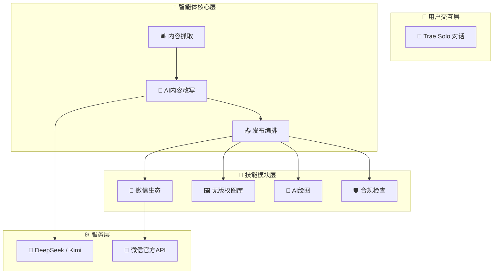

# 从零搭建微信公众号自动发文智能体 - 小白完整教程

> **适用人群**：零基础新手，你不需要会写代码——只需要会用鼠标和键盘，能对 AI 说话。
> **开发方式**：全程在 **Trae IDE 的 Solo 模式**下，你对 AI 说需求，AI 帮你写代码、创建文件、运行命令。
> **AI 模型**：本教程使用 **DeepSeek + Kimi 2.6** 驱动文章改写。
> **最终成果**：一个能自动抓取文章、AI改写去AI味、自动排版、自动发布到微信公众号的全流程智能体。

---

## 📖 教程目录（共 6 章，按顺序阅读）

| 章节 | 文件 | 内容 |
|------|------|------|
| **第 1 章** | [tutorial-01-intro.md](tutorial-01-intro.md) | 前言、两种创作模式、准备工作（申请微信/DeepSeek/无版权图库API）、环境搭建、项目骨架 |
| **第 2 章** | [tutorial-02-scraper.md](tutorial-02-scraper.md) | 配置文件管理、核心模块：文章抓取（数据模型→平台路由→3级抓取引擎→内容提取→噪音过滤→格式化） |
| **第 3 章** | [tutorial-03-rewrite.md](tutorial-03-rewrite.md) | 核心模块：AI内容改写（去AI味Prompt设计、标题优化、LLM调用与JSON解析） |
| **第 4 章** | [tutorial-04-skills.md](tutorial-04-skills.md) | 四大技能模块：无版权图片搜索、AI绘图（DALL-E封面）、内容合规检查、微信生态（Token/草稿/发布） |
| **第 5 章** | [tutorial-05-publish.md](tutorial-05-publish.md) | MCP服务（把所有能力串成统一接口）、端到端发布流程、模式二：根据主题自动原创生成 |
| **第 6 章** | [tutorial-06-pitfalls.md](tutorial-06-pitfalls.md) | 8个常见坑与解决方案、进阶优化方向、总结 |

---

## 🚀 快速开始

1. 按章节顺序从上往下读（共 6 章）
2. 每个章节的代码你**不需要自己写**——打开 Trae IDE 的 Solo 模式，对 AI 说"帮我创建这个文件"，把代码贴给它就行
3. 遇到报错把错误信息告诉 AI，它会帮你修
4. 读完 6 章就能从零跑通整个发布流程

---

## 📊 系统架构预览



---

## 🎯 两种创作模式

| 模式 | 触发方式 | 适用场景 |
|------|---------|---------|
| **模式一：洗稿** | 给一个微信公众号文章链接 | 看到好文章想"借鉴" |
| **模式二：主题原创** | 给一个主题/关键词 | 脑子里有话题想原创 |

```
模式一：📎 文章链接 → 🕷️ 爬虫抓取 → 🤖 AI改写 → 🎨 配图 → ✅ 合规 → 📤 发布
模式二：✏️ 主题关键词 → 🔍 AI搜索资料 → 📝 AI生成文章 → 🎨 配图 → ✅ 合规 → 📤 发布
```

---

*点击上方表格中的链接开始阅读第 1 章 →*
