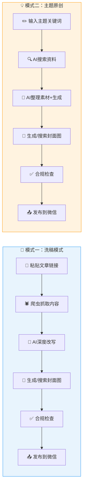
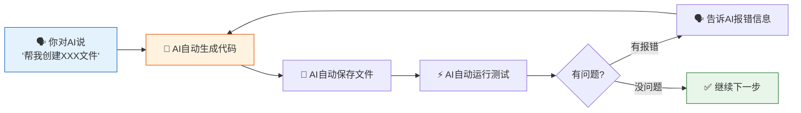
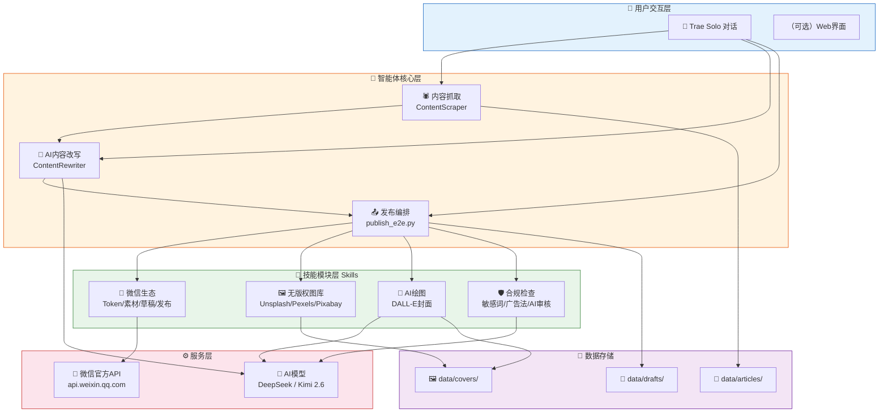
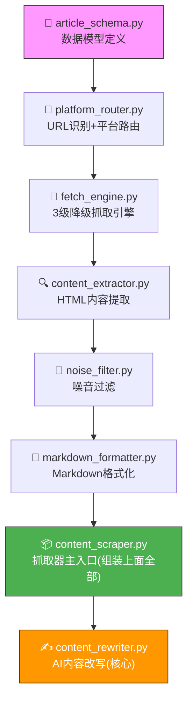
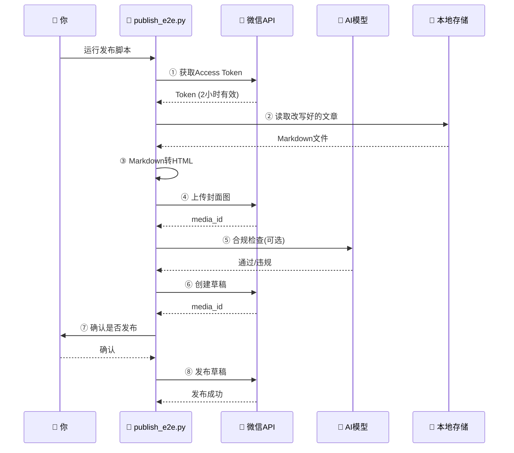

# 从零搭建微信公众号自动发文智能体 - 小白完整教程

> **适用人群**：零基础新手，你不需要会写代码——只需要会用鼠标和键盘，能对 AI 说话。
> **开发方式**：全程在 **Trae IDE 的 Solo 模式**下，你对 AI 说需求，AI 帮你写代码、创建文件、运行命令。
> **AI 模型**：本教程使用 **DeepSeek + Kimi 2.6** 驱动文章改写（你也可以换成其他兼容 OpenAI 接口的模型）。
> **最终成果**：一个能自动抓取文章、AI改写去AI味、自动排版、自动发布到微信公众号的全流程智能体。

---

## 目录

1. [前言：这个智能体能做什么？](#前言这个智能体能做什么)
2. [准备工作：你需要申请哪些东西](#准备工作你需要申请哪些东西)
3. [环境搭建：安装必要的软件](#环境搭建安装必要的软件)
4. [项目骨架搭建](#项目骨架搭建)
5. [配置文件管理](#配置文件管理)
6. [核心模块开发：文章抓取](#核心模块开发文章抓取)
7. [核心模块开发：AI内容改写](#核心模块开发ai内容改写)
8. [技能模块：图片素材](#技能模块图片素材)
9. [技能模块：AI绘图](#技能模块ai绘图)
10. [技能模块：内容合规检查](#技能模块内容合规检查)
11. [技能模块：微信生态](#技能模块微信生态)
12. [MCP服务：把所有能力串起来](#mcp服务把所有能力串起来)
13. [端到端发布流程（模式一：洗稿发布）](#端到端发布流程)
14. [模式二：根据主题自动原创生成](#模式二补充根据主题自动原创生成)
15. [常见坑与解决方案](#常见坑与解决方案)
16. [进阶优化方向](#进阶优化方向)

---

## 前言：这个智能体能做什么？

这个智能体支持**两种创作模式**，覆盖你日常写公众号文章的所有场景：

### 模式一：根据已有文章改写（洗稿模式）

你看到一篇写得不错的文章，想参考它的内容但要有自己的原创表达。

```
① 给智能体一个微信公众号文章链接
        ↓
② 用爬虫把文章内容抓取下来（标题、正文、图片）
        ↓
③ 用AI对文章进行深度改写（去AI味、提高原创度、调整风格）
        ↓
④ 用AI生成封面图（或从无版权图库搜索配图）
        ↓
⑤ 对改写后的内容进行合规检查（敏感词、广告法）
        ↓
⑥ 上传图片到微信公众号素材库
        ↓
⑦ 创建文章草稿
        ↓
⑧ 发布（或提交人工审核）
```

### 模式二：根据主题自动生成（纯原创模式）

你脑子里有一个话题/关键词，但还没有具体素材——让AI帮你从零到一写出一篇完整的原创文章。

```
① 你告诉智能体一个主题（比如"AI中转站商业模式分析"）
        ↓
② AI 自动联网搜索相关资料（新闻、数据、观点）
        ↓
③ AI 整理素材，提取核心观点和关键数据
        ↓
④ AI 按照你指定的风格生成一篇完整的原创文章
        ↓
⑤ AI 自动生成封面图（或从无版权图库搜索配图）
        ↓
⑥ 合规检查 → 上传素材 → 发布
```

> 💡 比如你对 Trae 的 AI 说：**"帮我写一篇关于'AI中转站商业模式'的公众号深度分析文章，风格偏商业分析，3000字左右"**，它就会自动搜索资料、整理素材、生成文章、配图、发布，你只需要确认一下就行。

**核心价值**：不管是洗稿别人的好文章，还是从零原创一个话题，这个智能体都能帮你把每天 2-3 小时的内容创作压缩到 5 分钟。

📊 **两种模式链路对比图**（一眼看懂系统工作原理）：



---

## 准备工作：你需要申请哪些东西

在写一行代码之前，先把下面这些"账号和密钥"搞定。**这是最容易踩坑的环节，请耐心完成**。

### 1. 一个微信公众号（必须）

- **类型**：订阅号或服务号都可以
- **注册地址**：https://mp.weixin.qq.com
- **准备材料**：身份证、一个未被微信公众平台绑定的邮箱
- **注意**：个人只能注册订阅号，每天可以群发 1 条消息。企业可以注册服务号。

> ⚠️ **关键信息**：注册成功后，你需要获取两个核心参数：
> - **AppID**：在「设置与开发 → 基本配置」中查看
> - **AppSecret**：点击「生成」按钮，用管理员微信扫码后获取。**这个密钥只显示一次，务必保存好！**

### 2. AI 大模型 API Key（必须）

- **作用**：驱动AI改写文章、生成封面图、内容合规审核
- **本教程使用的模型**：
  - **DeepSeek**：https://platform.deepseek.com —— 便宜大碗，中文改写效果极佳，支持 OpenAI 兼容接口。新用户送免费额度。
  - **Kimi（月之暗面）**：https://platform.moonshot.cn —— 长文本处理能力强，适合长文章改写。

> 💡 如果你有其他模型方案，可以直接替换，只要模型支持 OpenAI 兼容的 Chat Completions 接口即可。在 `.env` 文件中改一下 `AI_API_BASE` 和 `AI_MODEL` 就行。

> ⚠️ **省钱提示**：文章改写用 DeepSeek 级别模型完全够用，单篇文章改写成本约 1-2 分钱人民币。先用便宜模型跑通流程，效果不满意再换贵的。

### 3. 无版权图片库 API（可选但强烈建议）

如果你的文章需要配图（绝大多数文章都需要），注册以下**至少一个**图片库的 API。前两个免费额度很充裕：

| 平台 | 注册地址 | 免费额度 |
|------|---------|---------|
| **Unsplash** | https://unsplash.com/developers | 每小时 50 次请求 |
| **Pexels** | https://www.pexels.com/api | 每月 200 次请求 |
| **Pixabay** | https://pixabay.com/api/docs | 免费，无需注册 |

> 注册后获取的密钥在对应平台分别叫做：
> - Unsplash：Access Key
> - Pexels：API Key
> - Pixabay：API Key

### 4. Trae IDE（零代码基础也能用的 AI 编程工具）

- **Trae IDE**（字节跳动出品）：https://www.trae.ai
  - 完全免费，内置 AI 编程助手
  - **Solo 模式**：你只需要用自然语言对 AI 说话，AI 会自动帮你创建文件、写代码、运行命令，你基本不需要自己动手敲命令
  - 本教程的核心开发方式就是 **"你说话，AI 干活"**——你只需告诉 Trae 的 AI "帮我创建一个 Python 项目""帮我安装依赖""帮我写一个文章抓取模块"，它就帮你全部搞定
  - 本教程中使用的 MCP（Model Context Protocol）功能也需要 Trae IDE 的支持

> 💡 **本教程的开发理念**：你不需要懂太多代码。你只要知道你要做什么，然后把需求用**普通话**告诉 Trae 的 AI，它就会自动帮你创建文件、写代码、安装依赖。教程中展示的所有代码，你都可以通过跟 AI 对话来生成，不用自己一行行敲。

---

## 环境搭建：安装必要的软件

> 💡 **重要提示**：下面这两步（Python 和 Node.js 安装）需要你自己在电脑上安装好，因为这是系统级的软件。后面的所有操作，你都可以在 Trae IDE 里对 AI 说一句话就搞定，不需要自己敲命令。

### 第一步：安装 Python

1. 打开浏览器，访问：https://www.python.org/downloads/
2. 下载 **Python 3.10 或更高版本**（建议 3.11 或 3.12）
3. **安装时务必勾选"Add Python to PATH"**（这一步非常重要，否则后面命令行无法识别 `python` 命令）

安装完后，打开 PowerShell，输入 `python --version` 验证，应该输出类似 `Python 3.12.0`。

### 第二步：安装 Node.js（用于爬虫）

智能体使用 Playwright 进行浏览器级别的文章抓取，这需要 Node.js。

1. 访问：https://nodejs.org
2. 下载 **LTS 版本**（长期支持版，当前推荐 20.x 或 22.x）
3. 一路默认安装即可

安装完后，输入 `node --version` 和 `npm --version` 验证。

### 第三步：打开 Trae IDE，用 Solo 模式开始开发

1. 打开 Trae IDE，点击 **Solo 模式**
2. 在对话框里告诉 AI：

> "帮我在桌面上创建一个叫'微信公众号自动发文'的文件夹，在里面初始化一个 Python 项目，创建虚拟环境 venv，然后创建 requirements.txt 并安装这些依赖：wechatpy、openai、requests、beautifulsoup4、lxml、python-dotenv、pillow、markdown、pyyaml、cachetools、playwright、scrapling。"

AI 会自动帮你完成：

- 创建项目文件夹和 Python 虚拟环境
- 生成 `requirements.txt` 并安装所有依赖
- 执行 `playwright install chromium` 安装浏览器

### 第四步：初始化 Git（可选）

同样，在 Trae 对话框里说：

> "帮我初始化 git 仓库，创建 .gitignore 文件，忽略 venv/、__pycache__/、.env 等文件。"

到这一步，电脑环境就准备好了。**你从头到尾只在初期安装了两个软件，剩下的全是跟 AI 说话搞定的。** 接下来继续用这种方式写代码。

---

📊 **你的开发方式**（不用写代码，只动嘴）：



> 💡 看到没？就是一个循环：**你说需求 → AI写代码 → 跑一跑 → 有问题告诉AI → AI修 → 继续下一个模块**。教程后面每个章节的代码你不需要自己写，把代码块内容丢给AI就行。

## 项目骨架搭建

在 Trae 的 Solo 模式对话框里说：

> "帮我按照以下结构创建项目目录，并且在每个 Python 包文件夹里放入空的 __init__.py 文件："

然后把下面的目录结构贴给 AI，它会自动帮你全部创建好：

```
微信公众号自动发文/
├── config/           # 配置文件
├── data/
│   ├── articles/     # 抓取和改写后的文章
│   ├── covers/       # 封面图
│   ├── drafts/       # 草稿
│   └── published/    # 已发布记录
├── docs/             # 文档
├── scripts/          # 运行脚本
├── skills/           # 技能模块
│   ├── wechat_ecosystem/
│   ├── copyright_free_images/
│   ├── ai_drawing/
│   └── content_compliance/
├── src/
│   ├── core/         # 核心模块
│   ├── models/       # 数据模型
│   ├── services/     # 服务层
│   └── utils/        # 工具函数
├── tests/            # 测试
├── .env              # 环境变量（敏感信息）
├── .gitignore
├── requirements.txt
└── README.md
```

> 💡 一句话总结本教程的操作方式：**以后每个步骤，你只需要把教程里"创建 XXX 文件，写入以下内容"后面的代码，复制粘贴给 Trae 的 AI，对它说"帮我创建这个文件"，它就会自动帮你生成。** 教程里展示的所有代码，你不需要手打，甚至不需要完全理解——AI 会帮你搞定。

---

📊 **系统架构全景图**（先看看整个系统长什么样，心里有数）：



---

## 配置文件管理

配置文件是整个项目的"控制面板"，所有密钥和参数都在这里集中管理。

### 1. 创建环境变量模板

创建 `config\.env.example` 文件（对 Trae AI 说"帮我创建配置文件模板"）：

```
# ============================================
# 微信公众号全自动发布智能体 - 环境变量配置模板
# 复制此文件为 .env 并填入真实值
# ============================================

# 微信公众号配置
WECHAT_APP_ID=your_app_id_here
WECHAT_APP_SECRET=your_app_secret_here

# AI模型API配置（本教程使用 DeepSeek 和 Kimi）
AI_API_KEY=your_api_key_here
AI_API_BASE=https://api.deepseek.com/v1
AI_MODEL=deepseek-chat

# 日志级别
LOG_LEVEL=INFO

# 运行环境
ENVIRONMENT=development
```

### 2. 创建真实配置文件

对 Trae AI 说"帮我复制 config/.env.example 为项目根目录的 .env"，然后用文本编辑器打开 `.env` 文件，把占位符替换成你申请到的真实密钥：

```
WECHAT_APP_ID=wx1234567890abcdef
WECHAT_APP_SECRET=abc123def456ghi789
AI_API_KEY=sk-your-deepseek-api-key
AI_API_BASE=https://api.deepseek.com/v1
AI_MODEL=deepseek-chat
```

> ⚠️ **极其重要的安全提醒**：
> 1. `.env` 文件包含你的所有密钥，**绝对不要上传到 GitHub 或分享给别人**！
> 2. `.gitignore` 文件里已经写了 `.env`，确保它不会被 Git 追踪。
> 3. 如果你用其他模型，修改 `AI_API_BASE` 和 `AI_MODEL` 即可：
>    - DeepSeek: `https://api.deepseek.com/v1`，模型 `deepseek-chat`
>    - Kimi: `https://api.moonshot.cn/v1`，模型 `moonshot-v1-8k`

### 3. 创建 YAML 应用配置

创建 `config\config.yaml` 文件，这是应用的全局配置：

```yaml
# ============================================
# 微信公众号全自动发布智能体 - 应用配置
# ============================================

app:
  name: "WeChat Auto Publisher"
  version: "0.1.0"
  debug: true

# 微信公众号配置
wechat:
  app_id: ""          # 从环境变量 WECHAT_APP_ID 读取
  app_secret: ""      # 从环境变量 WECHAT_APP_SECRET 读取
  token_cache_seconds: 7200   # Access Token 缓存时间

# AI模型配置
ai:
  provider: "deepseek"
  model: "deepseek-chat"
  temperature: 0.7
  max_tokens: 4000
  timeout: 60
  max_retries: 3

# 发布配置
publish:
  default_style: "professional"
  max_article_length: 5000
  require_review: true
  auto_publish: false

# 日志配置
logging:
  level: "INFO"
  rotation: "00:00"
  retention: "30 days"

# 数据存储
storage:
  drafts_dir: "data/drafts"
  published_dir: "data/published"
  templates_dir: "data/templates"
```

### 4. 创建技能注册配置

创建 `skills\skills.json`，这个文件声明了所有技能模块的信息：

```json
{
  "skills": {
    "wechat-ecosystem": {
      "name": "微信生态全量技能",
      "version": "1.0.0",
      "description": "微信公众号全生命周期管理：素材管理、草稿创建/编辑/发布、Token管理",
      "capabilities": ["素材管理", "草稿管理", "文章发布", "二维码生成", "菜单管理"],
      "config_required": ["WECHAT_APP_ID", "WECHAT_APP_SECRET"]
    },
    "copyright-free-images": {
      "name": "无版权商用图片素材技能",
      "version": "1.0.0",
      "description": "多渠道无版权图片搜索与下载",
      "capabilities": ["跨平台图片搜索", "批量下载", "尺寸筛选"],
      "config_required": ["UNSPLASH_ACCESS_KEY|PEXELS_API_KEY|PIXABAY_API_KEY"]
    },
    "ai-drawing": {
      "name": "AI绘图技能",
      "version": "1.0.0",
      "description": "AI文生图：DALL-E API、封面图自动生成",
      "capabilities": ["文生图", "封面图生成", "多风格支持"],
      "config_required": ["AI_API_KEY"]
    },
    "content-compliance": {
      "name": "内容合规校验技能",
      "version": "1.0.0",
      "description": "中文内容合规审查：敏感词检测、广告法检查、AI内容安全审核",
      "capabilities": ["敏感词检测", "广告法合规检查", "AI深度审核"],
      "config_required": ["AI_API_KEY"]
    }
  }
}
```

---

📊 **核心模块依赖关系图**（接下来的章节按这个顺序开发，每个模块做什么一目了然）：



## 核心模块开发：文章抓取

这是我们写的第一个真正干活的模块。它的作用是把微信公众号文章的内容（标题、正文、图片）完整抓取下来。

### 为什么需要这个模块？

微信公众号文章不能直接通过 `requests.get()` 获取到完整内容，因为微信的文章内容是通过 JavaScript 动态渲染的。所以我们需要用 **Playwright**（一个自动化浏览器工具）来模拟真实浏览器访问。

### 1. 创建文章数据模型

先用数据模型定义好"一篇文章长什么样"。

创建 `src\core\article_schema.py`：

```python
"""
文章数据模型 - 定义文章抓取全链路的结构化数据类型
"""

from enum import Enum
from typing import Optional
from dataclasses import dataclass, field


class PlatformType(str, Enum):
    """支持的平台类型"""
    WECHAT = "wechat"
    ZHIHU_ARTICLE = "zhihu_article"
    TOUTIAO = "toutiao"
    UNKNOWN = "unknown"


class FetcherType(str, Enum):
    """抓取器类型 - 3级降级策略"""
    FETCHER = "Fetcher"           # 普通HTTP请求
    STEALTHY = "StealthyFetcher"  # 隐身模式（绕过基础反爬）
    DYNAMIC = "DynamicFetcher"    # 完整浏览器渲染


class ScrapeStatus(str, Enum):
    """抓取状态"""
    SUCCESS = "success"
    PARTIAL = "partial"
    FAILED = "failed"
    LOGIN_REQUIRED = "login_required"
    PAYWALL = "paywall"
    TIMEOUT = "timeout"
    BLOCKED = "blocked"


@dataclass
class ImageItem:
    """图片数据"""
    url: str
    alt: str = ""
    width: int = 0
    height: int = 0
    local_path: str = ""


@dataclass
class ArticleData:
    """文章完整数据"""
    url: str
    platform: PlatformType = PlatformType.UNKNOWN
    title: str = ""
    author: str = ""
    publish_time: str = ""
    content: str = ""              # 纯文本正文
    content_html: str = ""         # HTML格式正文
    summary: str = ""              # 摘要
    images: list[ImageItem] = field(default_factory=list)
    status: ScrapeStatus = ScrapeStatus.SUCCESS
    fetcher_used: FetcherType = FetcherType.FETCHER
    confidence: float = 0.0
    fetch_time_ms: int = 0
    retries: int = 0
    warnings: list[str] = field(default_factory=list)
    error_message: str = ""
    cached: bool = False


@dataclass
class FetchResult:
    """抓取结果"""
    url: str
    platform: PlatformType
    fetcher_type: FetcherType
    page_html: str
    http_status: int
    retries: int
    fetch_time_ms: int
    error: str = ""


@dataclass
class ScrapeConfig:
    """抓取配置"""
    timeout_default: int = 15
    timeout_dynamic: int = 30
    timeout_stealthy: int = 25
    max_retries_per_level: int = 2
    max_image_count: int = 20
    min_image_size: int = 100
    cache_enabled: bool = True
    user_agent: str = "Mozilla/5.0 (Windows NT 10.0; Win64; x64) AppleWebKit/537.36"
    headless: bool = True
    impersonate: str = "chrome120"
    backoff_base: int = 2
```

### 2. 创建平台路由

这个模块负责"识别用户给的 URL 是哪个平台的"，然后选择对应的抓取策略。

创建 `src\core\platform_router.py`：

```python
"""
平台路由器 - 识别URL来源并路由到对应抓取策略
"""

import re
from urllib.parse import urlparse

from src.core.article_schema import (
    PlatformType, PlatformRule, ScrapeConfig
)


# ============================================================
# 各平台的CSS选择器规则
# ============================================================

PLATFORM_RULES = {
    PlatformType.WECHAT: PlatformRule(
        platform=PlatformType.WECHAT,
        title_selectors=["#activity-name", ".rich_media_title", "h1"],
        content_selectors=["#js_content", ".rich_media_content"],
        author_selectors=["#js_name", ".rich_media_meta_text", ".profile_nickname"],
        time_selectors=["#publish_time", ".rich_media_meta_text"],
        needs_dynamic=True,   # 微信文章需要JS渲染
        needs_stealth=True,   # 需要反反爬
        noise_selectors=[".rich_media_area_extra", ".reward_area", ".like_comment_wrp"],
    ),
    PlatformType.ZHIHU_ARTICLE: PlatformRule(
        platform=PlatformType.ZHIHU_ARTICLE,
        title_selectors=[".Post-Title", ".QuestionHeader-title", "h1.Post-Title"],
        content_selectors=[".RichContent-inner", ".Post-RichText"],
        author_selectors=[".AuthorInfo-name", ".Post-Author"],
        time_selectors=[".ContentItem-time", ".Post-Header time"],
        needs_dynamic=True,
        noise_selectors=[".ContentItem-actions", ".Post-AuthorFollowButton"],
    ),
    PlatformType.UNKNOWN: PlatformRule(
        platform=PlatformType.UNKNOWN,
        title_selectors=["h1", "title", '[itemprop="headline"]', ".article-title"],
        content_selectors=["article", ".article-content", '[itemprop="articleBody"]', ".post-content", "main"],
        author_selectors=['[rel="author"]', ".author", '[itemprop="author"]'],
        time_selectors=["time", '[itemprop="datePublished"]', ".publish-time"],
    ),
}


class PlatformRouter:
    """根据URL识别平台"""

    # URL识别规则
    URL_PATTERNS = [
        (r"mp\.weixin\.qq\.com", PlatformType.WECHAT),
        (r"zhihu\.com/question/\d+/answer/\d+", PlatformType.ZHIHU_ANSWER),
        (r"zhihu\.com", PlatformType.ZHIHU_ARTICLE),
        (r"toutiao\.com", PlatformType.TOUTIAO),
    ]

    def identify(self, url: str) -> PlatformType:
        """根据URL自动识别平台"""
        for pattern, platform in self.URL_PATTERNS:
            if re.search(pattern, url, re.IGNORECASE):
                return platform
        return PlatformType.UNKNOWN

    def validate_url(self, url: str) -> tuple[bool, str]:
        """验证URL是否合法"""
        if not url:
            return False, "URL不能为空"
        try:
            parsed = urlparse(url)
            if not parsed.scheme or not parsed.netloc:
                return False, f"无效URL: {url}"
        except Exception as e:
            return False, f"URL解析失败: {e}"
        return True, ""

    def get_rule(self, platform: PlatformType) -> PlatformRule:
        """获取平台抓取规则"""
        return PLATFORM_RULES.get(platform, PLATFORM_RULES[PlatformType.UNKNOWN])
```

### 3. 创建抓取引擎

这是真正执行"去网页上拿内容"的模块。它采用了**3级降级抓取策略**：
- Level 1：普通 HTTP 请求（最快，但容易被拦截）
- Level 2：隐身模式（绕过基础反爬虫）
- Level 3：完整浏览器渲染（最强，能处理微信这种 JS 渲染的页面）

创建 `src\core\fetch_engine.py`：

```python
"""
抓取引擎 - 3级降级Fetcher + 重试 + 超时
"""

import time
import logging
from typing import Optional

from src.core.article_schema import (
    FetcherType, FetchResult, PlatformType, ScrapeConfig
)
from src.core.platform_router import PLATFORM_RULES

logger = logging.getLogger(__name__)


class FetchEngine:
    """3级降级抓取引擎"""

    def __init__(self, config: ScrapeConfig = None):
        self.config = config or ScrapeConfig()

    def fetch(self, url: str, platform: PlatformType = PlatformType.UNKNOWN) -> FetchResult:
        """主要抓取方法"""
        rule = PLATFORM_RULES.get(platform, PLATFORM_RULES[PlatformType.UNKNOWN])
        strategies = self._build_strategies(url, rule)
        last_error = ""

        for fetcher_type, method in strategies:
            t_start = time.time()
            retries = 0
            for attempt in range(self.config.max_retries_per_level + 1):
                try:
                    logger.info(f"[FetchEngine] {fetcher_type.value} 第{attempt+1}次尝试 {url}")
                    html, status = method(url)
                    elapsed_ms = int((time.time() - t_start) * 1000)
                    return FetchResult(
                        url=url, platform=platform, fetcher_type=fetcher_type,
                        page_html=html, http_status=status, retries=retries,
                        fetch_time_ms=elapsed_ms,
                    )
                except Exception as e:
                    retries = attempt
                    last_error = str(e)
                    logger.warning(f"[FetchEngine] {fetcher_type.value} 失败: {last_error}")
                    time.sleep(self.config.backoff_base ** attempt)

        return FetchResult(
            url=url, platform=platform, fetcher_type=FetcherType.DYNAMIC,
            page_html="", http_status=0, retries=0, fetch_time_ms=0,
            error=f"3级抓取全部失败: {last_error}",
        )

    def _build_strategies(self, url: str, rule):
        """按需构建抓取策略链"""
        strategies = []
        # Level 1: 普通HTTP
        strategies.append((FetcherType.FETCHER, lambda u: self._fetch_simple(u)))
        # Level 2: 隐身模式（如果需要）
        if rule.needs_stealth:
            strategies.append((FetcherType.STEALTHY, lambda u: self._fetch_stealthy(u)))
        # Level 3: 浏览器渲染（如果需要）
        if rule.needs_dynamic:
            strategies.append((FetcherType.DYNAMIC, lambda u: self._fetch_dynamic(u)))
        return strategies

    def _fetch_simple(self, url: str) -> tuple[str, int]:
        """普通HTTP请求"""
        import requests
        headers = {"User-Agent": self.config.user_agent}
        resp = requests.get(url, headers=headers, timeout=self.config.timeout_default)
        resp.raise_for_status()
        return resp.text, resp.status_code

    def _fetch_stealthy(self, url: str) -> tuple[str, int]:
        """隐身模式抓取"""
        import requests
        headers = {
            "User-Agent": self.config.user_agent,
            "Accept": "text/html,application/xhtml+xml",
            "Accept-Language": "zh-CN,zh;q=0.9",
            "Cache-Control": "no-cache",
        }
        resp = requests.get(url, headers=headers, timeout=self.config.timeout_stealthy)
        resp.raise_for_status()
        return resp.text, resp.status_code

    def _fetch_dynamic(self, url: str) -> tuple[str, int]:
        """浏览器级动态渲染（使用Playwright）"""
        try:
            from playwright.sync_api import sync_playwright
            with sync_playwright() as p:
                browser = p.chromium.launch(headless=self.config.headless)
                context = browser.new_context(
                    user_agent=self.config.user_agent,
                    viewport={"width": 1280, "height": 800},
                )
                page = context.new_page()
                page.goto(url, wait_until="networkidle", timeout=self.config.timeout_dynamic * 1000)
                page.wait_for_timeout(2000)
                html = page.content()
                browser.close()
                return html, 200
        except ImportError:
            raise ImportError("需要安装 playwright: pip install playwright && playwright install chromium")
```

### 4. 创建内容提取器

拿到 HTML 页面后，需要从中提取标题、正文、作者、时间、图片。

创建 `src\core\content_extractor.py`：

```python
"""
内容提取器 - 从HTML中提取结构化文章内容
"""

from bs4 import BeautifulSoup
from typing import Optional

from src.core.article_schema import (
    ArticleData, ImageItem, PlatformType, ScrapeStatus
)
from src.core.platform_router import PLATFORM_RULES


class ContentExtractor:
    """从HTML中提取文章结构化数据"""

    def extract(self, html: str, url: str, platform: PlatformType = PlatformType.UNKNOWN) -> ArticleData:
        """主提取方法"""
        soup = BeautifulSoup(html, "lxml")
        rule = PLATFORM_RULES.get(platform, PLATFORM_RULES[PlatformType.UNKNOWN])

        title = self._extract_text(soup, rule.title_selectors)
        author = self._extract_text(soup, rule.author_selectors)
        publish_time = self._extract_text(soup, rule.time_selectors)

        content_html = self._extract_content_html(soup, rule.content_selectors)
        content_text = BeautifulSoup(content_html, "lxml").get_text("\n", strip=True) if content_html else ""

        images = self._extract_images(content_html)

        return ArticleData(
            url=url,
            platform=platform,
            title=title,
            author=author,
            publish_time=publish_time,
            content=content_text,
            content_html=content_html,
            images=images,
            status=ScrapeStatus.SUCCESS if title and content_text else ScrapeStatus.PARTIAL,
            warnings=[] if title else ["未能提取到标题"],
        )

    def _extract_text(self, soup: BeautifulSoup, selectors: list[str]) -> str:
        """按优先级尝试多个选择器提取文本"""
        for selector in selectors:
            el = soup.select_one(selector)
            if el:
                return el.get_text().strip()
        return ""

    def _extract_content_html(self, soup: BeautifulSoup, selectors: list[str]) -> str:
        """提取正文HTML"""
        for selector in selectors:
            el = soup.select_one(selector)
            if el:
                return str(el)
        return ""

    def _extract_images(self, content_html: str) -> list[ImageItem]:
        """从正文中提取图片列表"""
        if not content_html:
            return []
        soup = BeautifulSoup(content_html, "lxml")
        images = []
        for img in soup.find_all("img"):
            src = img.get("src") or img.get("data-src") or img.get("data-original", "")
            if src and not src.startswith("data:image/svg"):
                images.append(ImageItem(
                    url=src,
                    alt=img.get("alt", ""),
                ))
        return images
```

### 5. 创建噪音过滤器

创建 `src\core\noise_filter.py`：

```python
"""
噪音过滤器 - 去除文章中的广告、推荐阅读等无关内容
"""

from bs4 import BeautifulSoup


class NoiseFilter:
    """基于CSS选择器和规则去除页面噪音"""

    # 通用噪音选择器
    COMMON_NOISE_SELECTORS = [
        ".advertisement", ".ads", ".banner",
        ".share-buttons", ".social-share",
        ".comment-area", ".comments",
        ".related-posts", ".recommend",
        ".footer", "footer",
    ]

    def filter(self, content_html: str, platform: str = "") -> str:
        """过滤噪音内容"""
        soup = BeautifulSoup(content_html, "lxml")

        # 去除通用噪音
        for selector in self.COMMON_NOISE_SELECTORS:
            for el in soup.select(selector):
                el.decompose()

        # 去除空标签
        for el in soup.find_all():
            if not el.get_text(strip=True) and el.name not in ["br", "hr", "img"]:
                el.decompose()

        return str(soup.body) if soup.body else str(soup)
```

### 6. 创建 Markdown 格式化器

创建 `src\core\markdown_formatter.py`：

```python
"""
Markdown格式化器 - 将文章数据输出为结构化Markdown和JSON
"""

import json
import os
from datetime import datetime

from src.core.article_schema import ArticleData, ScrapeStatus


class MarkdownFormatter:

    def to_markdown(self, article: ArticleData, include_metadata: bool = True,
                    include_images: bool = True) -> str:
        """输出Markdown格式"""
        lines = []

        if article.status != ScrapeStatus.SUCCESS:
            lines.append(f"# 抓取失败\n\n> URL: {article.url}\n> 状态: {article.status.value}")
            if article.error_message:
                lines.append(f"\n**错误**: {article.error_message}")
            return "\n".join(lines)

        if include_metadata:
            lines.append(f"# {article.title}")
            lines.append("")
            lines.append(f"> **来源**: {article.platform.value} · [原文链接]({article.url})")
            if article.author:
                lines.append(f"> **作者**: {article.author} · **时间**: {article.publish_time}")
            if article.cached:
                lines.append("> ⚡ *来自缓存*")
            lines.append("")
            lines.append("---")
            lines.append("")

        lines.append(article.content)
        lines.append("")

        if include_images and article.images:
            lines.append("---")
            lines.append("")
            lines.append("## 图片列表")
            lines.append("")
            for i, img in enumerate(article.images):
                lines.append(f"{i+1}. ")

        return "\n".join(lines)

    def to_json(self, article: ArticleData) -> str:
        """输出JSON格式"""
        return json.dumps(self.to_dict(article), ensure_ascii=False, indent=2)

    def to_dict(self, article: ArticleData) -> dict:
        """转为字典"""
        return {
            "url": article.url,
            "platform": article.platform.value,
            "title": article.title,
            "author": article.author,
            "publish_time": article.publish_time,
            "content_length": len(article.content),
            "content_preview": article.content[:200],
            "images": [{"url": i.url, "alt": i.alt} for i in article.images],
            "image_count": len(article.images),
            "fetcher_used": article.fetcher_used.value,
            "fetch_time_ms": article.fetch_time_ms,
            "retries": article.retries,
            "status": article.status.value,
            "warnings": article.warnings,
        }

    def save(self, article: ArticleData, output_dir: str = "data/articles") -> dict:
        """保存为文件"""
        os.makedirs(output_dir, exist_ok=True)
        safe_title = "".join(c for c in article.title[:40] if c.isalnum() or c in " _-").strip() or "article"
        timestamp = datetime.now().strftime("%Y%m%d_%H%M%S")
        base = os.path.join(output_dir, f"{timestamp}_{safe_title}")

        md_path = base + ".md"
        with open(md_path, "w", encoding="utf-8") as f:
            f.write(self.to_markdown(article))

        json_path = base + ".json"
        with open(json_path, "w", encoding="utf-8") as f:
            f.write(self.to_json(article))

        return {"markdown": md_path, "json": json_path}
```

### 7. 创建内容抓取器主入口

这是前面几个模块的"组装入口"，把它们串成一个完整的抓取链路。

创建 `src\core\content_scraper.py`：

```python
"""
网页内容自动抓取解析模块 - 主入口
完整链路：URL路由 → 抓取 → 提取 → 过滤 → 格式化
"""

import hashlib
import logging
from collections import OrderedDict

from src.core.article_schema import ArticleData, ScrapeConfig, ScrapeStatus, PlatformType
from src.core.platform_router import PlatformRouter
from src.core.fetch_engine import FetchEngine
from src.core.content_extractor import ContentExtractor
from src.core.noise_filter import NoiseFilter
from src.core.markdown_formatter import MarkdownFormatter

logger = logging.getLogger(__name__)

# 简易缓存（避免重复抓取同一URL）
_cache_store: OrderedDict = OrderedDict()
CACHE_MAX_SIZE = 500


class ContentScraper:
    """内容抓取器 - 统一入口"""

    def __init__(self, config: ScrapeConfig = None):
        self.config = config or ScrapeConfig()
        self.router = PlatformRouter()
        self.fetcher = FetchEngine(self.config)
        self.extractor = ContentExtractor()
        self.noise_filter = NoiseFilter()
        self.formatter = MarkdownFormatter()

    def scrape(self, url: str, platform_hint: str = "") -> ArticleData:
        """抓取单篇文章"""
        # 1. 验证URL
        valid, err = self.router.validate_url(url)
        if not valid:
            return ArticleData(url=url, status=ScrapeStatus.FAILED, error_message=err)

        # 2. 检查缓存
        if self.config.cache_enabled:
            cached = self._get_cache(url)
            if cached:
                cached.cached = True
                return cached

        # 3. 识别平台
        platform = PlatformType(platform_hint) if platform_hint else self.router.identify(url)

        # 4. 抓取
        fetch_result = self.fetcher.fetch(url, platform)
        if fetch_result.error:
            return ArticleData(
                url=url, platform=platform,
                status=ScrapeStatus.FAILED,
                fetcher_used=fetch_result.fetcher_type,
                error_message=fetch_result.error,
            )

        # 5. 提取
        article = self.extractor.extract(fetch_result.page_html, url, platform)
        article.fetcher_used = fetch_result.fetcher_type

        # 6. 过滤噪音
        article.content_html = self.noise_filter.filter(article.content_html, platform.value)

        # 7. 存入缓存
        if self.config.cache_enabled:
            self._set_cache(url, article)

        return article

    def _get_cache(self, url: str) -> ArticleData:
        cache_key = hashlib.md5(url.encode()).hexdigest()
        return _cache_store.get(cache_key)

    def _set_cache(self, url: str, article: ArticleData) -> None:
        cache_key = hashlib.md5(url.encode()).hexdigest()
        _cache_store[cache_key] = article
        while len(_cache_store) > CACHE_MAX_SIZE:
            _cache_store.popitem(last=False)
```

---

## 核心模块开发：AI内容改写

这是整个系统**最核心**的部分——用AI把抓取来的文章进行深度改写，达到"去AI味、口语化、提高原创度"的效果。

### AI改写的核心思路

很多AI生成的文章都有一个共同的问题：**有"AI味"**。比如：

- 每段都以"首先...其次...最后"开头
- 充斥着"在当今时代""值得注意的是""综上所述"等套话
- 喜欢用"标志着新篇章""具有里程碑意义"等夸张表达
- 大量使用破折号和冒号

这个模块通过精心设计的 **Prompt（提示词）** 来引导AI进行深度改写。

创建 `src\core\content_rewriter.py`：

```python
"""
AI内容改写模块 - Content Rewriter
基于LLM的文本改写：去AI味/口语化/提高原创度/风格转换/标题优化
"""

import os
import json
import logging
from typing import Optional
from dataclasses import dataclass

from src.core.article_schema import ArticleData

logger = logging.getLogger(__name__)


@dataclass
class RewriteResult:
    """改写结果"""
    title: str
    content: str
    summary: str
    original_title: str = ""
    original_length: int = 0
    rewritten_length: int = 0


# ============================================================
# Prompt 模板（这是整个系统的"灵魂"）
# ============================================================

HUMANIZE_PROMPT = """你是一位资深中文编辑，擅长将生硬的文字改写为自然流畅、有人情味的中文。

## 改写要求
1. **去AI味**：删除"在当今时代""值得注意的是""综上所述""此外""与此同时"等套话
2. **口语化**：使用更自然的表达，像朋友聊天一样，但保持专业性
3. **提高原创度**：改变句式结构，重新组织段落，用不同的词汇表达相同的意思
4. **保留核心信息**：不改变原文的事实、数据和观点
5. **优化结构**：使用小标题分隔，每段不宜过长（手机阅读友好）

## 禁止事项
- 不要添加原文没有的信息
- 不要使用"在这个快速发展的时代""标志着新篇章""具有里程碑意义"等AI常用套话
- 不要每段都以"首先/其次/最后"开头
- 不要过度使用破折号和冒号
- 不要使用"重磅""震惊""深度好文"等标题党词汇

## 输出格式
请以JSON格式返回（不要加```json标记）：
{{"title": "改写后的标题（20-30字）", "content": "改写后的正文（Markdown格式，使用##做小标题）", "summary": "100字以内的文章摘要"}}

## 原文标题
{title}

## 原文内容
{content}"""


TITLE_OPTIMIZE_PROMPT = """你是一位公众号标题优化专家。请为以下文章生成3个标题。

要求：
1. 包含核心关键词但不能堆砌
2. 有吸引力但不标题党（禁用"重磅""震惊""深度好文"）
3. 20-30字以内
4. 适合微信公众号传播

## 文章主题
{title}

## 文章摘要
{summary}

## 输出格式
{{"titles": ["标题1", "标题2", "标题3"], "best": "最佳标题", "reason": "推荐理由"}}"""


class ContentRewriter:
    """AI内容改写器"""

    def __init__(self, api_key: str = "", base_url: str = "https://api.deepseek.com/v1",
                 model: str = "deepseek-chat"):
        self.api_key = api_key or os.getenv("AI_API_KEY", "")
        self.base_url = base_url or os.getenv("AI_API_BASE", "https://api.deepseek.com/v1")
        self.model = model or os.getenv("AI_MODEL", "deepseek-chat")

    def humanize(self, article: ArticleData, max_chars: int = 6000) -> RewriteResult:
        """
        去AI味改写
        注意：如果文章太长，会截取前max_chars字进行改写
        """
        if not self.api_key:
            return RewriteResult(
                title=article.title,
                content=article.content,
                summary=article.content[:100] if article.content else "",
                original_title=article.title,
                original_length=len(article.content) if article.content else 0,
                rewritten_length=len(article.content) if article.content else 0,
            )

        content = article.content[:max_chars] if article.content else ""
        prompt = HUMANIZE_PROMPT.format(
            title=article.title,
            content=content,
        )

        result = self._call_llm(prompt)
        if result:
            return RewriteResult(
                title=result.get("title", article.title),
                content=result.get("content", content),
                summary=result.get("summary", content[:100]),
                original_title=article.title,
                original_length=len(content),
                rewritten_length=len(result.get("content", "")),
            )
        else:
            return RewriteResult(
                title=article.title,
                content=content,
                summary=content[:100],
                original_title=article.title,
                original_length=len(content),
                rewritten_length=len(content),
            )

    def optimize_titles(self, article: ArticleData) -> dict:
        """生成多个标题方案"""
        if not self.api_key:
            return {"titles": [article.title], "best": article.title, "reason": "API未配置"}

        prompt = TITLE_OPTIMIZE_PROMPT.format(
            title=article.title,
            summary=article.summary or article.content[:200],
        )
        result = self._call_llm(prompt)
        return result if result else {"titles": [article.title], "best": article.title, "reason": "生成失败"}

    def _call_llm(self, prompt: str, temperature: float = 0.7, max_tokens: int = 4000) -> Optional[dict]:
        """调用LLM API"""
        import requests
        url = f"{self.base_url}/chat/completions"
        headers = {
            "Authorization": f"Bearer {self.api_key}",
            "Content-Type": "application/json",
        }
        payload = {
            "model": self.model,
            "messages": [
                {"role": "system", "content": "你是一个专业的中文内容编辑助手，请始终以JSON格式返回结果。"},
                {"role": "user", "content": prompt},
            ],
            "temperature": temperature,
            "max_tokens": max_tokens,
        }

        try:
            resp = requests.post(url, headers=headers, json=payload, timeout=120)
            if resp.status_code != 200:
                logger.error(f"LLM API错误: {resp.status_code} {resp.text[:200]}")
                return None

            data = resp.json()
            content = data["choices"][0]["message"]["content"]

            # 尝试解析JSON（AI有时会多输出```json标记）
            content = content.strip()
            if content.startswith("```"):
                content = content.split("\n", 1)[1]
                if content.endswith("```"):
                    content = content[:-3]

            return json.loads(content)
        except json.JSONDecodeError as e:
            logger.error(f"JSON解析失败: {e}\n原始内容: {content[:500]}")
            return None
        except Exception as e:
            logger.error(f"LLM调用失败: {e}")
            return None
```

> ⚠️ **新手重点理解**：
> 1. `HUMANIZE_PROMPT` 是整个系统的核心，它决定了改写质量。你可以根据自己的写作风格来调整这个 Prompt。
> 2. `temperature: 0.7` 控制AI的"创造性"，0.0=非常保守，1.0=非常自由。改写类任务建议 0.7-0.8。
> 3. `_call_llm` 方法做了 `json.loads` 错误处理，因为AI有时候返回的JSON格式不完美。

---

## 技能模块：图片素材

这个模块负责从 Unsplash、Pexels、Pixabay 三个无版权图库搜索和下载图片。

创建 `skills\copyright_free_images\__init__.py`：

```python
"""
无版权商用图片素材技能模块
多渠道无版权图片搜索与下载：Unsplash、Pexels、Pixabay
"""

import os
import requests
from typing import Optional
from dataclasses import dataclass, field
from urllib.parse import quote_plus


@dataclass
class ImageResult:
    """图片搜索结果"""
    id: str
    url: str              # 预览图URL
    thumb_url: str        # 缩略图URL
    download_url: str     # 高清原图URL
    width: int
    height: int
    photographer: str = ""
    description: str = ""
    source: str = "unsplash"


class UnsplashClient:
    """Unsplash API 客户端"""
    BASE_URL = "https://api.unsplash.com"

    def __init__(self, access_key: str = ""):
        self.access_key = access_key

    def search(self, query: str, per_page: int = 10) -> list[ImageResult]:
        if not self.access_key:
            return []
        url = f"{self.BASE_URL}/search/photos"
        headers = {"Authorization": f"Client-ID {self.access_key}"}
        params = {"query": query, "per_page": per_page, "orientation": "landscape"}
        try:
            resp = requests.get(url, headers=headers, params=params, timeout=15)
            data = resp.json()
            results = []
            for item in data.get("results", []):
                results.append(ImageResult(
                    id=item["id"],
                    url=item["urls"]["regular"],
                    thumb_url=item["urls"]["thumb"],
                    download_url=item["urls"]["full"],
                    width=item.get("width", 0),
                    height=item.get("height", 0),
                    photographer=item["user"]["name"],
                    description=item.get("description") or item.get("alt_description", ""),
                    source="unsplash",
                ))
            return results
        except Exception as e:
            print(f"Unsplash搜索失败: {e}")
            return []

    def download(self, image: ImageResult, save_dir: str) -> Optional[str]:
        """下载图片到本地"""
        os.makedirs(save_dir, exist_ok=True)
        filepath = os.path.join(save_dir, f"unsplash_{image.id}.jpg")
        try:
            resp = requests.get(image.download_url, timeout=30)
            if resp.status_code == 200:
                with open(filepath, "wb") as f:
                    f.write(resp.content)
                return filepath
        except Exception as e:
            print(f"下载失败: {e}")
        return None


class PexelsClient:
    """Pexels API 客户端"""
    BASE_URL = "https://api.pexels.com/v1"

    def __init__(self, api_key: str = ""):
        self.api_key = api_key

    def search(self, query: str, per_page: int = 10) -> list[ImageResult]:
        if not self.api_key:
            return []
        headers = {"Authorization": self.api_key}
        params = {"query": query, "per_page": per_page, "orientation": "landscape"}
        try:
            resp = requests.get(f"{self.BASE_URL}/search", headers=headers, params=params, timeout=15)
            data = resp.json()
            results = []
            for item in data.get("photos", []):
                results.append(ImageResult(
                    id=str(item["id"]),
                    url=item["src"]["large"],
                    thumb_url=item["src"]["small"],
                    download_url=item["src"]["original"],
                    width=item.get("width", 0),
                    height=item.get("height", 0),
                    photographer=item["photographer"],
                    description=item.get("alt", ""),
                    source="pexels",
                ))
            return results
        except Exception as e:
            print(f"Pexels搜索失败: {e}")
            return []

    def download(self, image: ImageResult, save_dir: str) -> Optional[str]:
        os.makedirs(save_dir, exist_ok=True)
        filepath = os.path.join(save_dir, f"pexels_{image.id}.jpg")
        try:
            resp = requests.get(image.download_url, timeout=30)
            if resp.status_code == 200:
                with open(filepath, "wb") as f:
                    f.write(resp.content)
                return filepath
        except Exception as e:
            print(f"下载失败: {e}")
        return None


class PixabayClient:
    """Pixabay API 客户端"""
    BASE_URL = "https://pixabay.com/api"

    def __init__(self, api_key: str = ""):
        self.api_key = api_key

    def search(self, query: str, per_page: int = 10) -> list[ImageResult]:
        if not self.api_key:
            return []
        params = {
            "key": self.api_key, "q": query,
            "per_page": per_page, "orientation": "horizontal",
            "safesearch": "true",
        }
        try:
            resp = requests.get(self.BASE_URL, params=params, timeout=15)
            data = resp.json()
            results = []
            for item in data.get("hits", []):
                results.append(ImageResult(
                    id=str(item["id"]),
                    url=item["webformatURL"],
                    thumb_url=item["previewURL"],
                    download_url=item["largeImageURL"],
                    width=item.get("imageWidth", 0),
                    height=item.get("imageHeight", 0),
                    photographer=item.get("user", ""),
                    description=", ".join(filter(None, item.get("tags", "").split(", ")[:5])),
                    source="pixabay",
                ))
            return results
        except Exception as e:
            print(f"Pixabay搜索失败: {e}")
            return []

    def download(self, image: ImageResult, save_dir: str) -> Optional[str]:
        os.makedirs(save_dir, exist_ok=True)
        filepath = os.path.join(save_dir, f"pixabay_{image.id}.jpg")
        try:
            resp = requests.get(image.download_url, timeout=30)
            if resp.status_code == 200:
                with open(filepath, "wb") as f:
                    f.write(resp.content)
                return filepath
        except Exception as e:
            print(f"下载失败: {e}")
        return None


class CopyrightFreeImageSkills:
    """无版权图片技能 - 统一入口"""

    def __init__(self, unsplash_key: str = "", pexels_key: str = "",
                 pixabay_key: str = ""):
        self.unsplash = UnsplashClient(unsplash_key)
        self.pexels = PexelsClient(pexels_key)
        self.pixabay = PixabayClient(pixabay_key)

    def search_all(self, query: str, per_page: int = 30,
                   min_width: int = 800) -> list[ImageResult]:
        """跨平台搜索（聚合三个图库的结果）"""
        all_results = []

        # 从每个渠道搜索
        for client in [self.unsplash, self.pexels, self.pixabay]:
            try:
                results = client.search(query, per_page=min(per_page, 10))
                all_results.extend(results)
            except Exception:
                continue

        # 按最小宽度筛选
        if min_width:
            all_results = [r for r in all_results if r.width >= min_width]

        return all_results

    def download_best(self, images: list[ImageResult], save_dir: str,
                      max_count: int = 5) -> list[str]:
        """批量下载最好的几张图片"""
        downloaded = []
        for img in images[:max_count]:
            path = None
            if img.source == "unsplash":
                path = self.unsplash.download(img, save_dir)
            elif img.source == "pexels":
                path = self.pexels.download(img, save_dir)
            elif img.source == "pixabay":
                path = self.pixabay.download(img, save_dir)

            if path:
                downloaded.append(path)
        return downloaded

    def status(self) -> dict:
        return {
            "skill": "copyright-free-images",
            "version": "1.0.0",
            "channels": {
                "unsplash": bool(self.unsplash.access_key),
                "pexels": bool(self.pexels.api_key),
                "pixabay": bool(self.pixabay.api_key),
            },
            "status": "ready",
        }
```

> ⚠️ **小提示**：如果你不想注册三个图库的API，注册一个就够了。代码会自动跳过未配置的图库。

---

## 技能模块：AI绘图

这个模块使用 OpenAI 的 DALL-E 或兼容接口来生成文章封面图。

创建 `skills\ai_drawing\__init__.py`：

```python
"""
AI绘图技能模块 - 使用DALL-E生成图片和封面图
"""

import os
import time
import requests
import base64
from typing import Optional
from dataclasses import dataclass


@dataclass
class GeneratedImage:
    """生成的图片"""
    url: str = ""
    b64_json: str = ""
    revised_prompt: str = ""
    local_path: str = ""
    model: str = "dall-e-3"
    size: str = "1024x1024"


class DalleClient:
    """DALL-E API 客户端"""

    def __init__(self, api_key: str = "", base_url: str = "https://api.deepseek.com/v1"):
        self.api_key = api_key
        self.base_url = base_url

    def generate(self, prompt: str, model: str = "dall-e-3",
                 size: str = "1024x1024", quality: str = "standard",
                 style: str = "vivid") -> list[GeneratedImage]:
        """调用DALL-E生成图片"""
        url = f"{self.base_url}/images/generations"
        headers = {
            "Authorization": f"Bearer {self.api_key}",
            "Content-Type": "application/json",
        }
        payload = {
            "model": model,
            "prompt": prompt,
            "n": 1,
            "size": size,
            "quality": quality,
            "style": style,
        }
        resp = requests.post(url, headers=headers, json=payload, timeout=120)
        if resp.status_code != 200:
            raise Exception(f"DALL-E API错误: {resp.status_code} - {resp.text}")

        data = resp.json()
        results = []
        for item in data.get("data", []):
            results.append(GeneratedImage(
                url=item.get("url", ""),
                b64_json=item.get("b64_json", ""),
                revised_prompt=item.get("revised_prompt", ""),
                model=model,
                size=size,
            ))
        return results

    def generate_and_save(self, prompt: str, save_dir: str,
                          filename: str = "", **kwargs) -> list[GeneratedImage]:
        """生成并保存到本地"""
        images = self.generate(prompt, **kwargs)
        os.makedirs(save_dir, exist_ok=True)
        for i, img in enumerate(images):
            fname = filename or f"dalle_{int(time.time())}_{i}.png"
            filepath = os.path.join(save_dir, fname)
            if img.url:
                img_data = requests.get(img.url, timeout=30).content
                with open(filepath, "wb") as f:
                    f.write(img_data)
                img.local_path = filepath
            elif img.b64_json:
                with open(filepath, "wb") as f:
                    f.write(base64.b64decode(img.b64_json))
                img.local_path = filepath
        return images


class CoverImageGenerator:
    """封面图生成器 - 专为微信公众号优化"""

    def __init__(self, dalle_client: DalleClient):
        self.dalle = dalle_client

    def generate_cover(self, title: str, style: str = "professional",
                       save_dir: str = "data/covers") -> Optional[GeneratedImage]:
        """根据文章标题自动生成封面图"""
        prompts = {
            "professional": (
                f"为标题为「{title}」的专业文章生成封面图。"
                "现代简约风格，商务配色（蓝/白/灰），几何图案装饰，"
                "适合微信公号封面。2.35:1比例，无水印，无文字。"
                "A professional cover image for a WeChat article. "
                "Modern minimalist style, business colors. No text, no watermark."
            ),
            "tech": (
                f"A futuristic tech-themed cover image for article '{title}'. "
                "Dark theme with neon accents, circuit patterns. "
                "2.35:1 aspect ratio, no text, no watermark."
            ),
            "creative": (
                f"为标题为「{title}」的创意文章生成封面图。"
                "色彩鲜艳，创意构图，插画风格。2.35:1比例，无水印，无文字。"
            ),
        }

        prompt = prompts.get(style, prompts["professional"])
        try:
            images = self.dalle.generate_and_save(
                prompt=prompt, save_dir=save_dir,
                filename=f"cover_{int(time.time())}.png",
                size="1792x1024",  # 微信封面比例接近2.35:1
                quality="standard",
                style="vivid",
            )
            return images[0] if images else None
        except Exception as e:
            print(f"封面图生成失败: {e}")
            return None


class AIDrawingSkills:
    """AI绘图技能 - 统一入口"""

    def __init__(self, api_key: str = "",
                 api_base: str = "https://api.deepseek.com/v1"):
        self.dalle = DalleClient(api_key=api_key, base_url=api_base)
        self.cover_generator = CoverImageGenerator(self.dalle)

    def text_to_image(self, prompt: str, **kwargs) -> list[GeneratedImage]:
        """文生图"""
        return self.dalle.generate(prompt, **kwargs)

    def generate_article_cover(self, title: str, style: str = "professional",
                               save_dir: str = "data/covers") -> Optional[GeneratedImage]:
        """根据标题生成文章封面"""
        return self.cover_generator.generate_cover(title, style, save_dir)

    def status(self) -> dict:
        return {
            "skill": "ai-drawing",
            "version": "1.0.0",
            "models": ["dall-e-2", "dall-e-3"],
            "capabilities": ["文生图", "封面图生成", "多风格支持"],
            "status": "ready" if self.dalle.api_key else "pending_config",
        }
```

> ⚠️ **重要说明**：
> - DALL-E 是 OpenAI 的图片生成服务，如果你的 API Key 是 DeepSeek 或 Kimi 的，这个模块**不会生效**（因为这些模型不支持图片生成）。
> - **推荐替代方案**：直接用前面"图片素材"模块从 Unsplash/Pexels/Pixabay 免费图库搜索封面图，完全免费且版权无忧。本教程的端到端发布流程也是用免费图库下载封面图。
> - 如果你确实想用 AI 生成封面图，可以另外申请一个 OpenAI 的 API Key 并在代码中单独配置。

---

## 技能模块：内容合规检查

这个模块对改写后的文章进行合规检查，避免发布后触犯微信的内容规则。

创建 `skills\content_compliance\__init__.py`：

```python
"""
内容合规校验技能模块
敏感词检测 + 广告法检查 + AI内容安全审核
"""

import re
import json
import requests
from typing import Optional
from dataclasses import dataclass, field


@dataclass
class ComplianceResult:
    """合规检查结果"""
    passed: bool
    score: float = 100.0
    violations: list[str] = field(default_factory=list)
    suggestions: list[str] = field(default_factory=list)
    risk_level: str = "none"   # none / low / medium / high


class SensitiveWordDetector:
    """敏感词检测器（规则匹配）"""

    # 微信常见的违规内容正则模式
    SENSITIVE_PATTERNS = [
        (r"(赌博|博彩|赌场|六合彩|时时彩)", "赌博相关内容"),
        (r"(色情|黄色|成人|激情|一夜情|约炮)", "色情低俗内容"),
        (r"(贩卖|出售.*枪支|购买.*弹药)", "违禁物品"),
        (r"(吸毒|毒品|大麻|海洛因|冰毒|摇头丸)", "毒品相关内容"),
        (r"(传销|拉人头|下线|金字塔)", "传销内容"),
        (r"(高利贷|裸贷|校园贷|套路贷)", "非法借贷"),
        (r"(代孕|试管婴儿.*包成功)", "代孕相关"),
        (r"(翻墙|VPN.*免费|科学上网.*免费)", "网络工具违规推广"),
    ]

    # 广告法违禁词
    AD_LAW_PATTERNS = [
        (r"(最好|第一|唯一|最.*的|顶级|极品|国家级|世界级)", "广告法禁用极限词"),
        (r"(100%|百分百|绝对|彻底|完全.*有效)", "广告法禁用绝对化承诺"),
        (r"(永久|终身|永不|永远)", "广告法禁用时间无限词"),
        (r"(包治|根治|治愈|康复.*保证)", "医疗广告违规用语"),
        (r"(无效退款|保证有效|必有效|一定有效)", "疗效保证违规"),
    ]

    def detect(self, content: str) -> list[str]:
        """检测违规内容"""
        violations = []
        for pattern, desc in self.SENSITIVE_PATTERNS:
            if re.search(pattern, content, re.IGNORECASE):
                violations.append(f"[敏感内容] {desc}")
        for pattern, desc in self.AD_LAW_PATTERNS:
            if re.search(pattern, content, re.IGNORECASE):
                violations.append(f"[广告法] {desc}")
        return violations


class AIContentChecker:
    """AI内容安全审核器（调用LLM进行深度审核）"""

    CHECK_PROMPT = """你是一个中文内容安全审核专家。请审查以下文章是否存在违规问题。

审查维度：
1. 政治敏感：是否涉及敏感政治话题、领导人负面言论
2. 色情低俗：是否包含性暗示、低俗内容
3. 暴力恐怖：是否包含暴力、血腥、恐怖主义内容
4. 谣言虚假：是否传播未经证实的谣言
5. 广告违规：是否违反广告法（极限词、虚假承诺）
6. 侵权风险：是否涉及抄袭、侵犯知识产权

文章内容：
---
{content}
---

请以JSON格式返回：
{{"passed": true/false, "violations": ["违规项"], "risk_level": "none/low/medium/high", "suggestions": ["修改建议"]}}"""

    def __init__(self, api_key: str = "", base_url: str = "https://api.deepseek.com/v1",
                 model: str = "deepseek-chat"):
        self.api_key = api_key
        self.base_url = base_url
        self.model = model

    def check(self, content: str, max_length: int = 4000) -> ComplianceResult:
        if not self.api_key:
            return ComplianceResult(passed=True, score=80.0, risk_level="low",
                                    suggestions=["AI审核未配置API密钥，仅进行规则检查"])

        truncated = content[:max_length]
        prompt = self.CHECK_PROMPT.format(content=truncated)
        url = f"{self.base_url}/chat/completions"
        headers = {"Authorization": f"Bearer {self.api_key}", "Content-Type": "application/json"}
        payload = {
            "model": self.model,
            "messages": [{"role": "user", "content": prompt}],
            "temperature": 0.1,
            "max_tokens": 1000,
        }
        try:
            resp = requests.post(url, headers=headers, json=payload, timeout=30)
            if resp.status_code != 200:
                return ComplianceResult(passed=True, score=70.0, risk_level="low",
                                        suggestions=["AI审核服务暂时不可用"])
            data = resp.json()
            result = json.loads(data["choices"][0]["message"]["content"])
            return ComplianceResult(
                passed=result.get("passed", True),
                score=100.0 if result.get("passed") else 50.0,
                violations=result.get("violations", []),
                suggestions=result.get("suggestions", []),
                risk_level=result.get("risk_level", "none"),
            )
        except Exception as e:
            return ComplianceResult(passed=True, score=70.0, risk_level="low",
                                    suggestions=[f"AI审核异常: {str(e)}"])


class ContentComplianceSkills:
    """内容合规校验技能 - 统一入口"""

    def __init__(self, ai_api_key: str = "",
                 ai_base_url: str = "https://api.deepseek.com/v1",
                 ai_model: str = "deepseek-chat"):
        self.sensitive_detector = SensitiveWordDetector()
        self.ai_checker = AIContentChecker(
            api_key=ai_api_key, base_url=ai_base_url, model=ai_model
        )

    def quick_check(self, content: str) -> ComplianceResult:
        """快速检查（仅规则匹配，不调用AI）"""
        violations = self.sensitive_detector.detect(content)
        if violations:
            return ComplianceResult(
                passed=False,
                score=max(0, 100 - len(violations) * 15),
                violations=violations,
                suggestions=["请修改以上违规内容后重新提交"],
                risk_level="high" if len(violations) >= 3 else "medium",
            )
        return ComplianceResult(passed=True, score=100.0, risk_level="none")

    def full_check(self, content: str) -> ComplianceResult:
        """完整检查（规则 + AI深度审核）"""
        rule_result = self.quick_check(content)
        if not rule_result.passed:
            return rule_result

        ai_result = self.ai_checker.check(content)
        all_violations = rule_result.violations + ai_result.violations
        all_suggestions = rule_result.suggestions + ai_result.suggestions

        return ComplianceResult(
            passed=ai_result.passed and rule_result.passed,
            score=min(rule_result.score, ai_result.score),
            violations=all_violations,
            suggestions=all_suggestions,
            risk_level=ai_result.risk_level if ai_result.risk_level != "none" else rule_result.risk_level,
        )

    def check_title(self, title: str) -> ComplianceResult:
        """标题合规检查"""
        violations = self.sensitive_detector.detect(title)
        if violations:
            return ComplianceResult(
                passed=False, score=80.0, violations=violations,
                suggestions=["标题存在违规用词，请修改"],
                risk_level="medium",
            )
        return ComplianceResult(passed=True, score=100.0, risk_level="none")

    def status(self) -> dict:
        return {
            "skill": "content-compliance",
            "version": "1.0.0",
            "checkers": {
                "sensitive_word_detector": True,
                "ad_law_checker": True,
                "ai_content_checker": bool(self.ai_checker.api_key),
            },
            "status": "ready",
        }
```

---

## 技能模块：微信生态

这是**最关键的模块**，负责与微信公众号后台 API 进行交互，包括：获取 Access Token、上传图片素材、创建草稿、发布文章。

创建 `skills\wechat_ecosystem\__init__.py`：

```python
"""
微信生态全量技能模块
微信公众号全生命周期管理：素材管理、草稿创建/发布、Token管理
"""

import requests
import time
from typing import Any, Optional
from dataclasses import dataclass


@dataclass
class WeChatConfig:
    """微信配置"""
    app_id: str = ""
    app_secret: str = ""
    base_url: str = "https://api.weixin.qq.com"


class WeChatTokenManager:
    """Access Token 管理器 - 自动获取、缓存、刷新

    微信的Access Token有效期2小时，这个管理器会自动缓存并在过期前刷新。
    """

    def __init__(self, config: WeChatConfig):
        self.config = config
        self._token: Optional[str] = None
        self._expires_at: float = 0

    def get_token(self) -> str:
        """获取有效的Access Token"""
        # 如果Token存在且距离过期还有5分钟以上，直接返回
        if self._token and time.time() < self._expires_at - 300:
            return self._token
        self._refresh_token()
        return self._token

    def _refresh_token(self) -> None:
        """刷新Access Token"""
        url = f"{self.config.base_url}/cgi-bin/token"
        params = {
            "grant_type": "client_credential",
            "appid": self.config.app_id,
            "secret": self.config.app_secret,
        }
        resp = requests.get(url, params=params, timeout=10)
        data = resp.json()
        if "access_token" in data:
            self._token = data["access_token"]
            self._expires_at = time.time() + data.get("expires_in", 7200)
            print(f"✅ Token获取成功，有效期{data.get('expires_in', 7200)}秒")
        else:
            raise Exception(f"获取Access Token失败: {data}")


class WeChatMaterialManager:
    """素材管理器 - 上传图片/获取素材列表/删除素材"""

    def __init__(self, token_manager: WeChatTokenManager, config: WeChatConfig):
        self.token_manager = token_manager
        self.config = config

    def upload_image(self, file_path: str) -> dict:
        """上传图片为永久素材，返回 media_id 和 url"""
        token = self.token_manager.get_token()
        url = f"{self.config.base_url}/cgi-bin/material/add_material?access_token={token}&type=image"
        with open(file_path, "rb") as f:
            resp = requests.post(url, files={"media": f}, timeout=30)
        return resp.json()

    def upload_temp_image(self, file_path: str) -> dict:
        """上传临时图片素材（3天有效，但速度快，适合草稿配图）"""
        token = self.token_manager.get_token()
        url = f"{self.config.base_url}/cgi-bin/media/upload?access_token={token}&type=image"
        with open(file_path, "rb") as f:
            resp = requests.post(url, files={"media": f}, timeout=30)
        return resp.json()

    def get_material_list(self, material_type: str = "image",
                          offset: int = 0, count: int = 20) -> dict:
        """获取素材列表"""
        token = self.token_manager.get_token()
        url = f"{self.config.base_url}/cgi-bin/material/batchget_material?access_token={token}"
        payload = {"type": material_type, "offset": offset, "count": count}
        resp = requests.post(url, json=payload, timeout=10)
        return resp.json()


class WeChatDraftManager:
    """草稿管理器 - 创建/获取/删除/发布草稿"""

    def __init__(self, token_manager: WeChatTokenManager, config: WeChatConfig):
        self.token_manager = token_manager
        self.config = config

    def create_draft(self, articles: list[dict]) -> dict:
        """
        创建草稿
        articles参数格式：
        [{
            "title": "文章标题",
            "content": "<p>文章正文HTML</p>",
            "thumb_media_id": "封面图media_id",
            "digest": "文章摘要（可选）",
            "author": "作者名（可选）",
            "content_source_url": "原文链接（可选）",
            "need_open_comment": 0,  # 是否开启评论
            "only_fans_can_comment": 0,  # 是否仅粉丝可评论
        }]
        """
        import json
        token = self.token_manager.get_token()
        url = f"{self.config.base_url}/cgi-bin/draft/add?access_token={token}"

        # ⚠️ 关键：手动用 ensure_ascii=False 序列化，防止中文被转义
        payload_bytes = json.dumps(
            {"articles": articles},
            ensure_ascii=False
        ).encode("utf-8")

        headers = {"Content-Type": "application/json; charset=utf-8"}
        resp = requests.post(url, data=payload_bytes, headers=headers, timeout=30)
        return resp.json()

    def get_draft(self, media_id: str) -> dict:
        """获取草稿详情"""
        token = self.token_manager.get_token()
        url = f"{self.config.base_url}/cgi-bin/draft/get?access_token={token}"
        resp = requests.post(url, json={"media_id": media_id}, timeout=10)
        return resp.json()

    def delete_draft(self, media_id: str) -> dict:
        """删除草稿"""
        token = self.token_manager.get_token()
        url = f"{self.config.base_url}/cgi-bin/draft/delete?access_token={token}"
        resp = requests.post(url, json={"media_id": media_id}, timeout=10)
        return resp.json()

    def publish_draft(self, media_id: str) -> dict:
        """发布草稿"""
        token = self.token_manager.get_token()
        url = f"{self.config.base_url}/cgi-bin/freepublish/submit?access_token={token}"
        resp = requests.post(url, json={"media_id": media_id}, timeout=30)
        return resp.json()

    def get_publish_status(self, publish_id: str) -> dict:
        """查询发布状态"""
        token = self.token_manager.get_token()
        url = f"{self.config.base_url}/cgi-bin/freepublish/get?access_token={token}"
        resp = requests.post(url, json={"publish_id": publish_id}, timeout=10)
        return resp.json()


class WeChatEcosystemSkills:
    """微信生态技能 - 统一入口"""

    def __init__(self, app_id: str = "", app_secret: str = ""):
        self.config = WeChatConfig(app_id=app_id, app_secret=app_secret)
        self.token_manager = WeChatTokenManager(self.config)
        self.material = WeChatMaterialManager(self.token_manager, self.config)
        self.draft = WeChatDraftManager(self.token_manager, self.config)

    def get_access_token(self) -> str:
        """获取Access Token"""
        return self.token_manager.get_token()

    def upload_image(self, file_path: str) -> dict:
        """上传图片素材"""
        return self.material.upload_image(file_path)

    def create_draft(self, title: str, content: str,
                     thumb_media_id: str = "",
                     digest: str = "",
                     author: str = "",
                     content_source_url: str = "") -> dict:
        """创建草稿"""
        articles = [{
            "title": title,
            "content": content,
            "thumb_media_id": thumb_media_id,
            "digest": digest,
            "author": author,
            "content_source_url": content_source_url,
            "need_open_comment": 0,
            "only_fans_can_comment": 0,
        }]
        return self.draft.create_draft(articles)

    def publish_draft(self, media_id: str) -> dict:
        """发布草稿"""
        return self.draft.publish_draft(media_id)

    def get_publish_status(self, publish_id: str) -> dict:
        """查询发布状态"""
        return self.draft.get_publish_status(publish_id)

    def status(self) -> dict:
        return {
            "skill": "wechat-ecosystem",
            "version": "1.0.0",
            "capabilities": [
                "素材管理", "草稿管理", "文章发布",
                "Access Token管理", "发布状态查询",
            ],
            "configured": bool(self.config.app_id and self.config.app_secret),
            "status": "ready" if self.config.app_id else "pending_config",
        }
```

> ⚠️ **微信公众号 API 的重要限制**：
> 1. Access Token 有效期只有 **2小时**，调用频率限制为每日 2000 次。
> 2. 订阅号每天只能群发 **1条** 消息（通过发布接口"发布"不限次数，但不推送粉丝）。
> 3. 图片素材上传接口限制：永久素材总量上限 5000 个（含图文）。
> 4. `create_draft` 中的 `content` 必须是 **HTML格式**，不是 Markdown！

---

## MCP服务：把所有能力串起来

**MCP（Model Context Protocol）** 是 Anthropic 推出的一种标准协议，让 AI 助手（如 Claude、Trae IDE 的 AI）能够调用外部工具。

简单说：你注册了这个 MCP 服务后，就可以在 Trae IDE 里直接对 AI 说"帮我抓取这篇微信文章，改写后发布"，AI 就能自动调用你写的这些技能模块。

创建 `src\services\mcp\server.py`：

```python
"""
微信公众号MCP服务 - Model Context Protocol Server

使用 JSON-RPC 2.0 协议，提供以下工具：
- wechat_get_access_token     获取Token
- wechat_create_draft          创建草稿
- wechat_publish_draft         发布草稿
- wechat_upload_image          上传图片
- wechat_content_check         内容合规检查
- wechat_search_images         搜索无版权图片
- wechat_ai_draw               AI生成图片
- wechat_generate_cover        生成封面图
"""

import os
import sys
import json
import asyncio
from typing import Any
from pathlib import Path

# 确保能找到项目模块
PROJECT_ROOT = Path(__file__).resolve().parent.parent.parent.parent
if str(PROJECT_ROOT) not in sys.path:
    sys.path.insert(0, str(PROJECT_ROOT))


class WeChatMCPServer:
    """微信公众号 MCP Server"""

    def __init__(self):
        self._skills_loaded = False

    def _load_skills(self):
        """懒加载所有技能模块（第一次调用时才加载）"""
        if self._skills_loaded:
            return

        # 从环境变量读取密钥
        from dotenv import load_dotenv
        load_dotenv(PROJECT_ROOT / ".env")

        from skills.wechat_ecosystem import WeChatEcosystemSkills
        from skills.content_compliance import ContentComplianceSkills
        from skills.copyright_free_images import CopyrightFreeImageSkills
        from skills.ai_drawing import AIDrawingSkills

        self.wechat = WeChatEcosystemSkills(
            app_id=os.getenv("WECHAT_APP_ID", ""),
            app_secret=os.getenv("WECHAT_APP_SECRET", ""),
        )
        self.compliance = ContentComplianceSkills(
            ai_api_key=os.getenv("AI_API_KEY", ""),
            ai_base_url=os.getenv("AI_API_BASE", "https://api.deepseek.com/v1"),
        )
        self.images = CopyrightFreeImageSkills(
            unsplash_key=os.getenv("UNSPLASH_ACCESS_KEY", ""),
            pexels_key=os.getenv("PEXELS_API_KEY", ""),
            pixabay_key=os.getenv("PIXABAY_API_KEY", ""),
        )
        self.drawing = AIDrawingSkills(
            api_key=os.getenv("AI_API_KEY", ""),
            api_base=os.getenv("AI_API_BASE", "https://api.deepseek.com/v1"),
        )
        self._skills_loaded = True

    def get_tools(self) -> list[dict]:
        """返回所有可用工具的定义（供MCP客户端发现）"""
        return [
            {
                "name": "wechat_get_access_token",
                "description": "获取微信公众号Access Token",
                "inputSchema": {"type": "object", "properties": {}, "required": []},
            },
            {
                "name": "wechat_create_draft",
                "description": "创建微信公众号文章草稿",
                "inputSchema": {
                    "type": "object",
                    "properties": {
                        "title": {"type": "string", "description": "文章标题"},
                        "content": {"type": "string", "description": "文章正文(HTML格式)"},
                        "thumb_media_id": {"type": "string", "description": "封面图media_id"},
                        "digest": {"type": "string", "description": "文章摘要"},
                        "author": {"type": "string", "description": "作者名称"},
                    },
                    "required": ["title", "content"],
                },
            },
            {
                "name": "wechat_publish_draft",
                "description": "发布微信公众号草稿",
                "inputSchema": {
                    "type": "object",
                    "properties": {
                        "media_id": {"type": "string", "description": "草稿media_id"},
                    },
                    "required": ["media_id"],
                },
            },
            {
                "name": "wechat_upload_image",
                "description": "上传图片到微信公众号素材库",
                "inputSchema": {
                    "type": "object",
                    "properties": {
                        "file_path": {"type": "string", "description": "本地图片文件路径"},
                    },
                    "required": ["file_path"],
                },
            },
            {
                "name": "wechat_content_check",
                "description": "对文章内容进行合规检查（敏感词+广告法+AI审核）",
                "inputSchema": {
                    "type": "object",
                    "properties": {
                        "content": {"type": "string", "description": "待检查的文章内容"},
                        "check_type": {
                            "type": "string",
                            "enum": ["quick", "full"],
                            "description": "quick=规则检查，full=规则+AI检查",
                        },
                    },
                    "required": ["content"],
                },
            },
            {
                "name": "wechat_search_images",
                "description": "搜索无版权商用图片素材（Unsplash/Pexels/Pixabay）",
                "inputSchema": {
                    "type": "object",
                    "properties": {
                        "query": {"type": "string", "description": "搜索关键词"},
                        "count": {"type": "integer", "description": "返回数量，默认10"},
                    },
                    "required": ["query"],
                },
            },
            {
                "name": "wechat_ai_draw",
                "description": "使用AI生成图片（DALL-E）",
                "inputSchema": {
                    "type": "object",
                    "properties": {
                        "prompt": {"type": "string", "description": "图片描述(prompt)"},
                        "size": {"type": "string", "description": "图片尺寸，默认1024x1024"},
                    },
                    "required": ["prompt"],
                },
            },
            {
                "name": "wechat_generate_cover",
                "description": "根据文章标题自动生成封面图",
                "inputSchema": {
                    "type": "object",
                    "properties": {
                        "title": {"type": "string", "description": "文章标题"},
                        "style": {"type": "string", "description": "风格: professional/tech/creative"},
                    },
                    "required": ["title"],
                },
            },
        ]

    def call_tool(self, tool_name: str, arguments: dict) -> Any:
        """执行工具调用"""
        self._load_skills()

        try:
            if tool_name == "wechat_get_access_token":
                return {"token": self.wechat.get_access_token()}

            elif tool_name == "wechat_create_draft":
                return self.wechat.create_draft(
                    title=arguments["title"],
                    content=arguments["content"],
                    thumb_media_id=arguments.get("thumb_media_id", ""),
                    digest=arguments.get("digest", ""),
                    author=arguments.get("author", ""),
                )

            elif tool_name == "wechat_publish_draft":
                return self.wechat.publish_draft(arguments["media_id"])

            elif tool_name == "wechat_upload_image":
                return self.wechat.upload_image(arguments["file_path"])

            elif tool_name == "wechat_content_check":
                check_type = arguments.get("check_type", "quick")
                if check_type == "full":
                    result = self.compliance.full_check(arguments["content"])
                else:
                    result = self.compliance.quick_check(arguments["content"])
                return {
                    "passed": result.passed,
                    "score": result.score,
                    "violations": result.violations,
                    "suggestions": result.suggestions,
                    "risk_level": result.risk_level,
                }

            elif tool_name == "wechat_search_images":
                results = self.images.search_all(
                    query=arguments["query"],
                    per_page=arguments.get("count", 10),
                )
                return [{
                    "id": r.id, "url": r.url, "thumb_url": r.thumb_url,
                    "width": r.width, "height": r.height,
                    "source": r.source, "description": r.description,
                } for r in results]

            elif tool_name == "wechat_ai_draw":
                images = self.drawing.text_to_image(
                    prompt=arguments["prompt"],
                    size=arguments.get("size", "1024x1024"),
                )
                return [{"url": img.url, "local_path": img.local_path} for img in images]

            elif tool_name == "wechat_generate_cover":
                img = self.drawing.generate_article_cover(
                    title=arguments["title"],
                    style=arguments.get("style", "professional"),
                )
                if img:
                    return {"url": img.url, "local_path": img.local_path}
                return {"error": "封面图生成失败"}

            else:
                return {"error": f"未知工具: {tool_name}"}

        except Exception as e:
            return {"error": str(e)}

    async def handle_request(self, request: dict) -> dict:
        """处理JSON-RPC请求"""
        method = request.get("method", "")

        if method == "tools/list":
            return {
                "jsonrpc": "2.0",
                "id": request.get("id"),
                "result": {"tools": self.get_tools()},
            }

        elif method == "tools/call":
            params = request.get("params", {})
            tool_name = params.get("name", "")
            arguments = params.get("arguments", {})
            result = self.call_tool(tool_name, arguments)
            return {
                "jsonrpc": "2.0",
                "id": request.get("id"),
                "result": {"content": [{"type": "text", "text": json.dumps(result, ensure_ascii=False)}]},
            }

        else:
            return {
                "jsonrpc": "2.0",
                "id": request.get("id"),
                "error": {"code": -32601, "message": f"未知方法: {method}"},
            }

    async def run_stdio(self):
        """以stdio模式运行MCP Server"""
        import sys

        print("WeChat MCP Server started (stdio mode)", file=sys.stderr)

        while True:
            try:
                line = await asyncio.get_event_loop().run_in_executor(
                    None, sys.stdin.readline
                )
                if not line:
                    break

                request = json.loads(line.strip())
                response = await self.handle_request(request)
                print(json.dumps(response, ensure_ascii=False), flush=True)

            except json.JSONDecodeError:
                continue
            except Exception as e:
                error_response = {
                    "jsonrpc": "2.0",
                    "id": None,
                    "error": {"code": -32603, "message": str(e)},
                }
                print(json.dumps(error_response, ensure_ascii=False), flush=True)


def main():
    server = WeChatMCPServer()
    asyncio.run(server.run_stdio())


if __name__ == "__main__":
    main()
```

### 配置 MCP 客户端（Trae IDE）

在项目根目录创建 `.mcp.json` 文件：

```json
{
  "mcpServers": {
    "wechat-official-account": {
      "command": "python",
      "args": ["src/services/mcp/server.py"],
      "env": {
        "WECHAT_APP_ID": "${WECHAT_APP_ID}",
        "WECHAT_APP_SECRET": "${WECHAT_APP_SECRET}",
        "AI_API_KEY": "${AI_API_KEY}",
        "AI_API_BASE": "${AI_API_BASE}",
        "UNSPLASH_ACCESS_KEY": "${UNSPLASH_ACCESS_KEY}",
        "PEXELS_API_KEY": "${PEXELS_API_KEY}",
        "PIXABAY_API_KEY": "${PIXABAY_API_KEY}"
      }
    }
  }
}
```

这个文件告诉 Trae IDE "这里有一个 MCP 服务，你可以调用它"。配置好后，你就可以在 IDE 里直接对 AI 发号施令了。

---

📊 **端到端发布数据流图**（从文章到微信后台，数据是怎么一步步流转的）：



## 端到端发布流程

现在所有模块都写好了，我们来把它们串成一个完整的"端到端发布流程"。

创建 `scripts\publish_e2e.py`：

```python
"""
微信公众号全自动发布 · 端到端流程

完整步骤：
  ① 获取Access Token
  ② 下载/生成封面图 → 上传到微信素材库
  ③ 读取改写好的文章
  ④ 合规检查
  ⑤ 创建草稿
  ⑥ 确认发布
"""

import os
import sys
import json
import requests
from pathlib import Path
from datetime import datetime

# 设置项目路径
PROJECT_ROOT = Path(__file__).resolve().parent.parent
sys.path.insert(0, str(PROJECT_ROOT))

# 从环境变量读取配置
from dotenv import load_dotenv
load_dotenv(PROJECT_ROOT / ".env")

APP_ID = os.getenv("WECHAT_APP_ID", "")
APP_SECRET = os.getenv("WECHAT_APP_SECRET", "")
BASE_URL = "https://api.weixin.qq.com"


def get_token():
    """获取Access Token"""
    url = f"{BASE_URL}/cgi-bin/token"
    params = {"grant_type": "client_credential", "appid": APP_ID, "secret": APP_SECRET}
    resp = requests.get(url, params=params, timeout=10)
    data = resp.json()
    if "access_token" in data:
        return data["access_token"]
    raise Exception(f"Token获取失败: {data}")


def download_cover():
    """下载封面图（示例：从Pexels下载一张图片）"""
    cover_url = "https://images.pexels.com/photos/534229/pexels-photo-534229.jpeg?auto=compress&cs=tinysrgb&w=1200"
    save_dir = PROJECT_ROOT / "data" / "covers"
    save_dir.mkdir(parents=True, exist_ok=True)
    filepath = save_dir / "cover_ai_resell.jpg"

    if filepath.exists():
        print(f"  封面图已存在: {filepath}")
        return str(filepath)

    resp = requests.get(cover_url, timeout=30)
    with open(filepath, "wb") as f:
        f.write(resp.content)
    print(f"  封面图下载完成: {filepath}")
    return str(filepath)


def upload_cover_image(token, filepath):
    """上传封面图到微信永久素材库"""
    url = f"{BASE_URL}/cgi-bin/material/add_material?access_token={token}&type=image"
    with open(filepath, "rb") as f:
        resp = requests.post(url, files={"media": f}, timeout=30)
    return resp.json()


def read_article():
    """读取改写好的文章"""
    articles_dir = PROJECT_ROOT / "data" / "articles"
    md_files = list(articles_dir.glob("*.md"))

    if not md_files:
        print("  没有找到改写文章，使用测试内容")
        return {
            "title": "AI中转站深度解析：从倒爷到商业帝国",
            "content": "<p>这是一篇测试文章，验证微信公众号自动发布链路是否畅通。</p>",
            "digest": "深度解析AI中转站商业模式",
        }

    # 使用最新的文章
    latest = max(md_files, key=lambda f: f.stat().st_mtime)
    print(f"  使用文章: {latest.name}")

    with open(latest, "r", encoding="utf-8") as f:
        md_content = f.read()

    # 简单Markdown转HTML（正式使用时建议用专门的转换器）
    title = md_content.split("\n")[0].replace("# ", "")
    content_html = markdown_to_html(md_content)
    digest = md_content.split("\n")[3][:100] if len(md_content.split("\n")) > 3 else title

    return {
        "title": title,
        "content": content_html,
        "digest": digest,
    }


def markdown_to_html(md_content: str) -> str:
    """简易Markdown转HTML（仅处理常见格式）"""
    lines = md_content.split("\n")
    html_lines = []
    in_paragraph = False

    for line in lines:
        line = line.strip()
        if not line:
            if in_paragraph:
                html_lines.append("</p>")
                in_paragraph = False
            continue

        # 标题
        if line.startswith("## "):
            if in_paragraph:
                html_lines.append("</p>")
                in_paragraph = False
            html_lines.append(f"<h2>{line[3:]}</h2>")

        elif line.startswith("# "):
            if in_paragraph:
                html_lines.append("</p>")
                in_paragraph = False
            html_lines.append(f"<h1>{line[2:]}</h1>")

        # 引用
        elif line.startswith("> "):
            if in_paragraph:
                html_lines.append("</p>")
                in_paragraph = False
            html_lines.append(f"<blockquote>{line[2:]}</blockquote>")

        # 分隔线
        elif line == "---":
            if in_paragraph:
                html_lines.append("</p>")
                in_paragraph = False
            html_lines.append("<hr/>")

        # 普通段落
        else:
            if not in_paragraph:
                html_lines.append("<p>")
                in_paragraph = True
            else:
                html_lines.append("<br/>")
            # 转义HTML特殊字符
            safe_line = line.replace("&", "&amp;").replace("<", "&lt;").replace(">", "&gt;")
            html_lines.append(safe_line)

    if in_paragraph:
        html_lines.append("</p>")

    return "\n".join(html_lines)


def create_draft(token, title, content, thumb_media_id, digest):
    """创建草稿"""
    url = f"{BASE_URL}/cgi-bin/draft/add?access_token={token}"
    payload = {
        "articles": [{
            "title": title,
            "content": content,
            "thumb_media_id": thumb_media_id,
            "digest": digest,
            "author": "",
            "content_source_url": "",
            "need_open_comment": 0,
            "only_fans_can_comment": 0,
        }]
    }
    # 手动序列化避免中文被转义
    payload_bytes = json.dumps(payload, ensure_ascii=False).encode("utf-8")
    headers = {"Content-Type": "application/json; charset=utf-8"}
    resp = requests.post(url, data=payload_bytes, headers=headers, timeout=30)
    return resp.json()


def main():
    print("=" * 55)
    print("  微信公众号全自动发布 · 端到端流程")
    print("=" * 55)

    # 检查配置
    if not APP_ID or not APP_SECRET:
        print("\n❌ 错误：请在 .env 文件中配置 WECHAT_APP_ID 和 WECHAT_APP_SECRET")
        return

    # Step 1: 获取Token
    print("\n[1/5] 获取 Access Token...")
    token = get_token()
    print(f"  ✅ Token: {token[:20]}...")

    # Step 2: 下载并上传封面图
    print("\n[2/5] 准备封面图...")
    cover_path = download_cover()

    print("  上传封面图到微信素材库...")
    upload_result = upload_cover_image(token, cover_path)
    print(f"  📤 上传结果: {json.dumps(upload_result, ensure_ascii=False, indent=2)}")

    if "media_id" not in upload_result:
        print(f"  ❌ 封面上传失败: {upload_result}")
        return

    thumb_media_id = upload_result["media_id"]
    print(f"  ✅ 封面图 media_id: {thumb_media_id}")

    # Step 3: 读取改写文章
    print("\n[3/5] 读取改写文章...")
    article = read_article()
    print(f"  ✅ 标题: {article['title']}")
    print(f"  ✅ 正文: {len(article['content'])} 字符")

    # Step 4: 合规检查
    print("\n[4/5] 内容合规检查...")
    from skills.content_compliance import ContentComplianceSkills
    compliance = ContentComplianceSkills(
        ai_api_key=os.getenv("AI_API_KEY", ""),
    )
    check_result = compliance.quick_check(article["title"] + article["content"])
    print(f"  检查结果: {'✅ 通过' if check_result.passed else '❌ 未通过'}")
    if not check_result.passed:
        print(f"  违规项: {check_result.violations}")
        response = input("\n  是否仍然继续发布？(y/n): ")
        if response.lower() != "y":
            print("  已取消发布")
            return

    # Step 5: 创建草稿
    print("\n[5/5] 创建草稿...")
    draft_result = create_draft(
        token=token,
        title=article["title"],
        content=article["content"],
        thumb_media_id=thumb_media_id,
        digest=article["digest"],
    )
    print(f"  📝 草稿结果: {json.dumps(draft_result, ensure_ascii=False, indent=2)}")

    if "media_id" in draft_result:
        media_id = draft_result["media_id"]
        print(f"\n  ✅ 草稿创建成功！media_id: {media_id}")
        print(f"  📱 请前往微信公众号后台查看草稿: https://mp.weixin.qq.com")

        # 询问是否直接发布
        response = input("\n  是否立即发布？(y/n): ")
        if response.lower() == "y":
            from skills.wechat_ecosystem import WeChatEcosystemSkills
            wechat = WeChatEcosystemSkills(app_id=APP_ID, app_secret=APP_SECRET)
            publish_result = wechat.publish_draft(media_id)
            print(f"  🚀 发布结果: {json.dumps(publish_result, ensure_ascii=False, indent=2)}")
    else:
        print(f"\n  ❌ 草稿创建失败: {draft_result}")
        print("  常见原因：")
        print("  1. 文章内容包含违规内容")
        print("  2. Access Token已过期")
        print("  3. 封面图media_id无效")
        print("  4. 正文HTML格式不正确")


if __name__ == "__main__":
    main()
```

### 主入口文件

创建 `src\main.py`：

```python
"""微信公众号全自动发布智能体 - 主入口"""

import sys
from pathlib import Path

sys.path.insert(0, str(Path(__file__).resolve().parent))


def main():
    print("=" * 50)
    print("  微信公众号全自动发布智能体 v0.1.0")
    print("=" * 50)
    print()
    print("用法：")
    print("  python scripts/publish_e2e.py    # 端到端发布流程")
    print("  python src/main.py test          # 测试各模块是否正常")
    print()
    print("模块状态：")

    # 检查各模块
    modules = {
        "内容抓取": "src.core.content_scraper",
        "内容改写": "src.core.content_rewriter",
        "合规检查": "skills.content_compliance",
        "图片搜索": "skills.copyright_free_images",
        "AI绘图": "skills.ai_drawing",
        "微信生态": "skills.wechat_ecosystem",
        "MCP服务": "src.services.mcp",
    }

    for name, module_path in modules.items():
        try:
            __import__(module_path)
            print(f"  ✅ {name}")
        except Exception as e:
            print(f"  ❌ {name}: {e}")

    print()
    print("提示：请确保 .env 文件已配置正确的密钥。")


if __name__ == "__main__":
    main()
```

---

## 模式二补充：根据主题自动原创生成

前面的端到端流程是"模式一（洗稿模式）"的完整代码。**模式二（主题原创生成）** 更简单——因为它不需要爬虫，直接用 AI 搜索资料并生成。

在 Trae 的 Solo 模式对话框里直接说：

> "帮我写一篇关于【你的主题】的公众号文章。要求：风格偏商业分析，3000字左右，用小标题分段，去AI味。写完后帮我做合规检查，生成封面图，上传到微信素材库创建草稿。"

AI 会自动完成以下步骤：
1. **资料搜索**：AI 利用自身知识+联网搜索能力，收集与主题相关的新闻、数据、观点
2. **素材整理**：提取核心信息，去重，按逻辑串成大纲
3. **文章生成**：按照你指定的风格和字数，写出完整文章
4. **后续流程**：合规检查 → 配图 → 创建草稿（跟模式一的步骤⑤~⑧一样）

> 💡 **两种模式怎么选？**
> - 你看到一篇好文章想"借鉴" → 用**模式一**，给链接
> - 你脑子里有个话题想写原创 → 用**模式二**，给主题
> - 两种模式的输出质量完全取决于你的 Prompt 写得好不好——主题描述越具体，AI 生成的文章越精准

---

## 常见坑与解决方案

### 坑1：Python 环境问题

**症状**：`pip install` 报错 或者 `python` 命令找不到

**解决**：
1. 确认 Python 已安装且加入 PATH：在命令行输入 `python --version`
2. 如果报错"无法识别"，重新安装 Python 并勾选"Add Python to PATH"
3. 确保在虚拟环境中执行：命令行前面有 `(venv)` 标识
4. 如果虚拟环境无法激活，尝试用 `python -m venv venv --clear` 重建

### 坑2：Playwright 安装失败

**症状**：运行爬虫时报 `playwright._impl._api_types.Error: Executable doesn't exist`

**解决**：
```powershell
# 手动安装 Chromium 浏览器
playwright install chromium

# 如果下载太慢，可以设置镜像
set PLAYWRIGHT_DOWNLOAD_HOST=https://npmmirror.com/mirrors/playwright/
playwright install chromium
```

### 坑3：微信 Access Token 获取失败

**症状**：`{"errcode": 40125, "errmsg": "invalid appsecret"}`

**解决**：
1. 检查 `.env` 文件中 `WECHAT_APP_ID` 和 `WECHAT_APP_SECRET` 是否正确（注意不要有多余空格）
2. AppSecret 是否已经重置过（微信公众号后台 → 设置与开发 → 基本配置 → 重置）
3. IP白名单是否配置（如果是企业号，需要在后台配置服务器IP白名单）

### 坑4：微信草稿创建失败

**症状**：`{"errcode": 40007, "errmsg": "invalid media_id"}` 或其他错误码

**常见错误码对照**：
| 错误码 | 含义 | 解决 |
|--------|------|------|
| 40007 | media_id无效 | 封面图上传失败或media_id过期 |
| 40001 | Access Token无效 | 重新获取Token |
| 45009 | 接口调用频率超限 | 等待后重试 |
| 45103 | 文章标题过长 | 标题限制64个字符(32个汉字) |

### 坑5：AI返回的 JSON 格式不对

**症状**：`json.decoder.JSONDecodeError`

**解决**：
1. 在 `_call_llm` 方法中已经做了清理（去掉 ```json``` 标记）
2. 如果仍然失败，尝试降低 temperature（如改为 0.3）
3. 在 Prompt 中加入更多格式示例
4. 如果模型能力不足（比如用了太便宜的模型），偶尔会输出不规范的JSON，可以尝试换一个更强的模型。

### 坑6：文章抓取失败（403/空内容）

**症状**：抓取微信文章返回空内容或 403 错误

**解决**：
1. 微信文章**必须**用 Playwright 的浏览器模式抓取（`_fetch_dynamic`），普通 requests 获取不到内容
2. 某些文章需要登录才能查看，这类文章无法直接抓取
3. 微信号如果被封禁过，部分文章会受限
4. 解决方案：使用隐身模式（StealthyFetcher）或更换 User-Agent

### 坑7：环境变量加载失败

**症状**：`WECHAT_APP_ID` 或 `AI_API_KEY` 获取不到

**解决**：
1. 确认 `.env` 文件在项目根目录且格式正确（`KEY=value`，没有引号）
2. 确认代码中使用了 `load_dotenv()` 加载
3. 注意 `.env` 中的值不要加引号：`AI_API_KEY=sk-abc123` ✅ 而非 `AI_API_KEY="sk-abc123"` ❌

### 坑8：中文乱码问题

**症状**：发布到微信的文章出现乱码

**解决**：
在 `create_draft` 中使用 `json.dumps(payload, ensure_ascii=False).encode("utf-8")` 手动序列化，不要用 `requests.post(url, json=payload)` 的自动序列化（会导致中文被转义成 `\uXXXX`）。

---

## 进阶优化方向

当你成功跑通基础流程后，可以考虑以下进阶优化：

### 1. 多内容源支持
目前只接入了微信公众号，可以扩展到：
- 知乎文章
- 今日头条
- 百度百家号
- 36氪 / 虎嗅

只需在 `platform_router.py` 中添加对应的 URL 识别规则和 CSS 选择器。

### 2. 模型切换
本教程默认使用 DeepSeek 和 Kimi，如果你想换成其他模型（只要支持 OpenAI 兼容接口就行），只需修改 `.env` 中的 `AI_API_BASE` 和 `AI_MODEL` 两行配置，代码不需要改。

### 3. 定时自动发布
在 `scripts/` 下添加一个定时任务脚本，配合 Windows 的"任务计划程序"或 Linux 的 `cron`：
- 每天早上 8 点自动抓取热门文章
- 自动改写
- 自动发布

### 4. 发布前端界面
用 Flask 或 Streamlit 做一个简单的 Web 界面：
- 输入文章链接
- 预览改写结果
- 一键发布

### 5. 更丰富的排版
- 代码高亮
- 表情包插入
- 引导关注/点赞的模板
- 文末"推荐阅读"模块

### 6. 数据分析
- Token 消耗统计（控制成本）
- 发布成功率
- 文章阅读量追踪（需要额外接入微信数据统计API）

---

## 总结

恭喜你！如果你跟着教程一步步做完了，你现在拥有一个：

- ✅ 能自动抓取微信公众号文章（模式一：洗稿）
- ✅ 能根据主题自动搜索资料并原创生成文章（模式二：主题原创）
- ✅ 能用 AI 深度改写去 AI 味
- ✅ 能搜索无版权图片或 AI 生成封面图
- ✅ 能自动检查内容合规性
- ✅ 能自动创建草稿并发布到微信公众号
- ✅ 能通过 MCP 协议让 AI 助手直接调用

的**全自动发文智能体**。

> **最后想说**：这个系统的灵魂不是代码，而是 **Prompt（提示词）**。不管是洗稿别人的好文章，还是根据主题从零原创，花时间打磨你的 Prompt，让 AI 的写作风格无限接近你自己的风格，这才是做出差异化内容的关键。代码只是骨架，Prompt 才是血肉。

如果你在搭建过程中遇到任何问题，欢迎随时向 AI 助手提问！

---

*文档版本：v1.1 | 更新日期：2026年5月*
